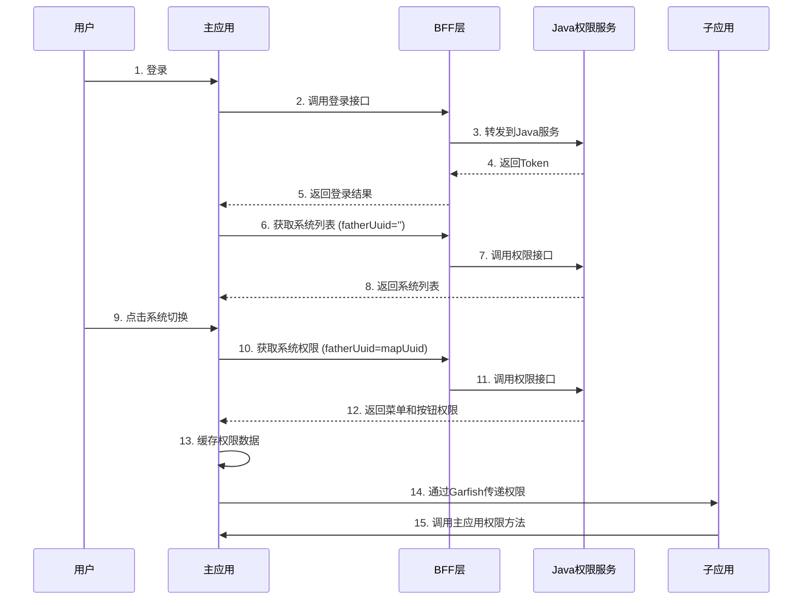

# 权限系统设计方案

## 📋 架构设计

### 权限层级

```
登录用户
  └─ 系统列表（第一层）
      ├─ Contract & Invoice (mapUuid: xxx)
      ├─ Budget & Purchasing (mapUuid: yyy)
      └─ Finance & Accounting (mapUuid: zzz)
           └─ 菜单和按钮权限（第二层）
                ├─ 菜单列表
                └─ 按钮权限码列表
```

### 调用流程



---

## 🚀 使用指南

### 1. 主应用 - 权限初始化

在用户登录成功后，自动获取系统列表：

```typescript
// fe/src/stores/modules/user.ts
async login(loginParams: LoginParams) {
  const response = await Login(loginParams);
  // ...登录逻辑

  // 登录成功后立即获取系统列表（第一层权限）
  await this.fetchSystemPermissions();
}
```

### 2. 主应用 - 系统切换组件

在顶部导航栏使用系统切换器：

```vue
<!-- fe/src/layouts/components/Header.vue -->
<template>
  <div class="header">
    <div class="logo">Logo</div>

    <!-- 系统切换器 -->
    <SystemSwitcher />

    <div class="user-info">...</div>
  </div>
</template>

<script setup lang="ts">
import SystemSwitcher from '@/components/SystemSwitcher.vue'
</script>
```

### 3. 主应用 - 权限检查

#### 方式一：使用指令（推荐）

```vue
<template>
  <!-- 单个权限码 -->
  <t-button v-permission="'user:add'">新增用户</t-button>

  <!-- 多个权限码（满足一个即可） -->
  <t-button v-permission="['user:edit', 'user:delete']">编辑</t-button>

  <!-- 需要满足所有权限 -->
  <t-button v-permission.all="['user:view', 'user:edit']">查看并编辑</t-button>
</template>
```

#### 方式二：使用 Hook

```vue
<script setup lang="ts">
import { usePermission } from '@/hooks/usePermission'

const { hasPermission, menus, buttons, currentSystem } = usePermission()

const canAdd = hasPermission('user:add')
const canEdit = hasPermission(['user:edit', 'user:delete'])
</script>

<template>
  <div>
    <t-button v-if="canAdd">新增</t-button>
    <span>当前系统：{{ currentSystem?.mapShowname }}</span>
  </div>
</template>
```

### 4. 子应用 - 接收权限数据

#### 方式一：通过 Garfish Props（推荐）

```typescript
// 子应用入口文件
export function provider({ dom, basename }) {
  return {
    render({ appName, dom, basename, props }) {
      // 从主应用获取权限信息
      const { permission, user, utils } = props

      // 保存到全局状态
      app.config.globalProperties.$mainApp = {
        permission,
        user,
        utils,
      }

      // 监听权限更新
      window.addEventListener('garfish:permission', (event) => {
        const { system, permissions } = event.detail.data
        console.log('权限已更新:', system, permissions)

        // 刷新子应用的权限状态
        updateLocalPermissions(permissions)
      })

      app.mount(dom)
    },
    destroy() {
      app.unmount()
    },
  }
}
```

#### 方式二：通过全局变量

```typescript
// 子应用中直接访问
const permissions = (window as any).__MICRO_APP_PERMISSIONS__

if (permissions) {
  const { system, menus, buttons } = permissions

  // 使用权限数据
  const hasPermission = (code: string) => {
    return buttons.includes(code)
  }
}
```

#### 方式三：调用主应用方法

```typescript
// 子应用组件中
export default {
  setup() {
    const mainApp = inject('$mainApp')

    // 检查权限
    const canAdd = mainApp.permission.hasPermission('user:add')

    // 获取菜单
    const menus = mainApp.permission.menus

    // 获取用户信息
    const userInfo = mainApp.user.userInfo

    return { canAdd, menus, userInfo }
  },
}
```

---

## 📦 接口说明

### 1. 获取系统列表（第一层权限）

**接口**: `POST /wb-acs/api/userPermissions/loadUserPermission`

**请求参数**:

```json
{
  "userName": "zhengcanhao",
  "fatherUuid": "" // 第一次调用传空
}
```

**返回数据**:

```json
{
  "code": 2000,
  "message": "操作成功",
  "data": [
    {
      "mapIndex": 100000,
      "mapUuid": "aabae637c413fa13376613df5d742c96",
      "mapShowname": "Contract & Invoice",
      "mapCode": "WBS_ContractAndInvoice",
      "mapIcon": "book"
    },
    {
      "mapIndex": 200000,
      "mapUuid": "4cf902e6633c2d4c020c46e87e804107",
      "mapShowname": "Budget & Purchasing",
      "mapCode": "WBS_BudgetAndPurchasing"
    }
  ]
}
```

### 2. 获取系统权限（第二层权限）

**接口**: `POST /wb-acs/api/userPermissions/loadUserPermission`

**请求参数**:

```json
{
  "userName": "zhengcanhao",
  "sysUuid": "5a1c4589c43c138c1478fe99aa61dd66",
  "fatherUuid": "aabae637c413fa13376613df5d742c96" // 上一层的 mapUuid
}
```

**返回数据**:

```json
{
  "code": 2000,
  "message": "操作成功",
  "data": [
    {
      "mapUuid": "menu-001",
      "mapShowname": "用户管理",
      "mapCode": "user:view",
      "mapType": "menu",
      "mapUrl": "/user/list"
    },
    {
      "mapUuid": "btn-001",
      "mapShowname": "新增用户",
      "mapCode": "user:add",
      "mapType": "button"
    }
  ]
}
```

---

## 🎯 核心优势

### ✅ 主应用调用的优势

1. **统一管理**: 权限数据在主应用集中管理，避免分散
2. **性能优化**:
   - 接口只调用一次，所有子应用共享
   - 内存缓存，系统切换无需重复请求
3. **安全性**:
   - 通过 BFF 层代理，隐藏 Java 服务地址
   - 统一 Token 管理和刷新
4. **一致性**: 所有子应用权限数据保持同步
5. **解耦**: 子应用无需关心权限服务的实现细节

### ❌ 子应用调用的缺点

1. ❌ 每个子应用都要调用一次接口
2. ❌ 权限数据可能不一致
3. ❌ 需要在每个子应用实现权限逻辑
4. ❌ 子应用卸载后权限数据丢失
5. ❌ 难以实现跨子应用的权限控制

---

## 📝 完整示例

### 主应用完整代码

```vue
<!-- 系统切换组件 -->
<template>
  <div class="system-tabs">
    <div
      v-for="system in systemList"
      :key="system.mapUuid"
      :class="['tab', { active: isActive(system) }]"
      @click="switchSystem(system)"
    >
      {{ system.mapShowname }}
    </div>
  </div>
</template>

<script setup lang="ts">
import { computed } from 'vue'
import { usePermissionStore } from '@/stores/modules/permission'

const permissionStore = usePermissionStore()
const systemList = computed(() => permissionStore.systemList)

const isActive = (system) => {
  return permissionStore.currentSystem?.mapUuid === system.mapUuid
}

const switchSystem = async (system) => {
  await permissionStore.switchSystem(system)
}
</script>
```

### 子应用完整代码

```typescript
// 子应用入口
import { createApp } from 'vue'
import App from './App.vue'

let app: any

export function provider({ dom, basename }) {
  return {
    render({ props }) {
      app = createApp(App)

      // 注入主应用提供的方法
      app.provide('$mainApp', props)

      app.mount(dom)
    },
    destroy() {
      app?.unmount()
    },
  }
}
```

```vue
<!-- 子应用组件 -->
<template>
  <div>
    <!-- 使用主应用权限 -->
    <t-button v-if="canAdd">新增</t-button>

    <!-- 显示当前系统 -->
    <span>{{ currentSystem?.mapShowname }}</span>
  </div>
</template>

<script setup lang="ts">
import { inject, computed } from 'vue'

const mainApp = inject('$mainApp')

const canAdd = computed(() => {
  return mainApp.permission.hasPermission('user:add')
})

const currentSystem = computed(() => {
  return mainApp.permission.currentSystem
})
</script>
```

---

## 🔧 高级特性

### 1. 权限缓存策略

```typescript
// 自动缓存，切换系统时无需重复请求
await permissionStore.switchSystem(system) // 第一次请求
await permissionStore.switchSystem(system) // 直接从缓存读取

// 手动清除缓存
permissionStore.clearCache()
```

### 2. 权限刷新

```typescript
// 主应用刷新权限
const permissionStore = usePermissionStore()
await permissionStore.loadSystemPermissions(currentSystem.mapUuid)

// 子应用主动刷新
await mainApp.permission.refreshPermissions()
```

### 3. 权限预加载

```typescript
// 登录后预加载第一个系统的权限
await fetchSystemPermissions()
if (permissionStore.systemList.length > 0) {
  await permissionStore.switchSystem(permissionStore.systemList[0])
}
```

---

## 🎓 最佳实践

1. **主应用职责**:
   - ✅ 调用权限接口
   - ✅ 缓存权限数据
   - ✅ 提供权限查询方法
   - ✅ 监听系统切换事件

2. **子应用职责**:
   - ✅ 从主应用获取权限
   - ✅ 根据权限控制 UI 显示
   - ❌ 不要直接调用权限接口

3. **通信方式**:
   - ✅ 优先使用 Garfish Props
   - ✅ 通过事件监听权限更新
   - ❌ 避免使用全局变量

4. **性能优化**:
   - ✅ 使用内存缓存
   - ✅ 权限数据持久化到 localStorage
   - ✅ 按需加载权限数据

---

## ⚠️ 注意事项

1. **Token 过期处理**: 权限接口需要携带 Token，注意处理过期场景
2. **权限数据格式**: 需根据实际返回数据调整 `transformPermissionData` 方法
3. **子应用兼容**: 确保所有子应用都能正确接收主应用传递的 props
4. **错误处理**: 权限接口失败时的降级策略
5. **开发环境**: 开发时可以 mock 权限数据方便调试
