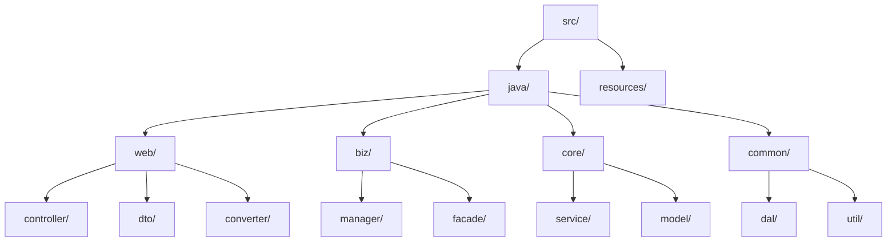
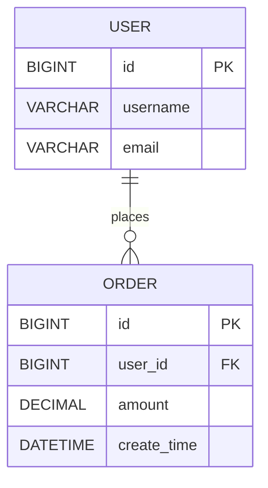
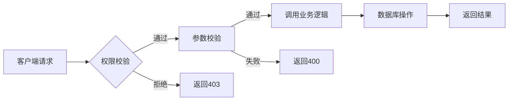

# 后端技术规格文档生成器

根据标准规范生成项目级或模块级的后端技术规格文档，确保文档结构完整、便于AI生成代码。

## 快速开始

### 1. 确定文档类型

| 类型 | 适用场景 | 模板 |
| --- | --- | --- |
| **项目级规格** | 新项目启动、全局技术标准定义 | project-spec.md |
| **模块级设计** | 具体功能模块、独立服务开发 | module-spec.md |

### 2. 信息收集清单

生成文档前，向用户收集以下信息：

**项目级必需：**

- [ ] 项目名称与技术背景
- [ ] 技术栈选型（框架、数据库、中间件）
- [ ] 项目目录结构
- [ ] 代码风格规范
- [ ] 全局设计规范

**模块级必需：**

- [ ] 模块名称与功能边界
- [ ] 业务流程描述
- [ ] 数据库表结构设计
- [ ] 接口设计（路径、方法、参数）
- [ ] 数据模型（Java Bean/DTO）
- [ ] 特殊约束（权限、性能等）

## 项目级规格文档

### 核心要素

1. **技术栈** - 框架、数据库、缓存、消息队列等
2. **全局设计规范** - 数据库设计、接口设计、异常处理等统一规则
3. **项目目录结构** - 使用 Mermaid 描述
4. **代码风格** - 包结构规范、类命名规范、导出规范

### 输出格式

```markdown
# 后端技术规格文档

## 1. 技术栈 (Tech Stack)
- **框架**: Spring Boot 2.7+ (Java 8+)
- **ORM**: MyBatis-Plus
- **数据库**: MySQL 8.0+
- **缓存**: Redis
- **消息队列**: RocketMQ

## 2. 全局设计规范 (Design System)
- **数据库设计规范**: [数据库设计规范描述]
- **接口设计规范**: [RESTful接口规范]
- **异常处理规范**: [统一异常处理]

## 3. 项目目录结构 (Project Structure)
[Mermaid 图]

## 4. 通用代码风格 (Coding Style)
- 包结构规范
- 类命名规范
- 导出规范
```

## 模块级设计文档

### 核心要素

1. **功能概述** - 模块目标、核心流程
2. **数据库设计** - 表结构、索引、关系
3. **接口设计** - API端点、方法、入参出参
4. **数据模型** - Java Bean/DTO定义
5. **业务逻辑** - 初始化、事件处理、校验逻辑
6. **特殊约束** - 权限控制、性能要求

### 输出格式

```markdown
# 模块设计文档: [模块名称]

## 1. 功能概述 (Overview)
- **目标**: [功能简述]
- **核心流程**: [业务路径]

## 2. 数据库设计 (Database Design)
[表结构设计]

## 3. 接口设计 (API Design)
[API端点列表]

## 4. 数据模型 (Data Model)
[Java Bean/DTO定义]

## 5. 业务逻辑 (Business Logic)
- **初始化**: [服务启动行为]
- **事件处理**: [业务逻辑]
- **校验逻辑**: [业务校验]

## 6. 特殊约束 (Constraints)
[权限、性能、安全等]
```

## 生成流程

```
生成任务进度：
- [ ] 步骤1：确定文档类型（项目级/模块级）
- [ ] 步骤2：收集必要信息
- [ ] 步骤3：填充模板框架
- [ ] 步骤4：绘制 Mermaid 图
- [ ] 步骤5：定义数据模型（Java Bean/DTO）
- [ ] 步骤6：定义接口协议
- [ ] 步骤7：编写业务逻辑
- [ ] 步骤8：审核文档完整性
```

### 步骤1：确定文档类型

询问用户：

> 您需要生成哪种类型的后端技术文档？
>
> 1. 项目级规格文档 - 定义项目全局技术标准、目录结构、代码风格
> 2. 模块级设计文档 - 定义具体功能模块的数据库、接口、业务逻辑

### 步骤2：收集信息

根据文档类型，使用对应的信息收集清单向用户提问。如用户已提供部分信息，跳过已知项。

### 步骤3-7：按模板填充

读取对应模板文件，逐节填充内容：

+ 项目级：templates/project-spec.md
+ 模块级：templates/module-spec.md

### 步骤8：完整性检查

**项目级检查项：**

- [ ] 技术栈选型完整
- [ ] 目录结构清晰（含 Mermaid 图）
- [ ] 设计规范覆盖核心场景
- [ ] 代码风格明确

**模块级检查项：**

- [ ] 功能边界明确
- [ ] 数据库设计完整
- [ ] Java Bean/DTO定义完整
- [ ] API协议明确（路径、方法、参数）
- [ ] 业务逻辑可执行
- [ ] 约束条件列出

## CRUD 设计规范（必须遵循）

所有文档必须遵循以下 CRUD 设计规范：

1. **筛选器行为**:
    - 筛选时不选择（清空状态）即视为选择"全部"
    - 下拉筛选菜单中不应包含显式的"全部"选项
    - 当所有筛选条件为空时，列表默认显示全部数据
2. **分页规范**: 所有列表查询必须支持分页
3. **软删除**: 所有数据表必须包含逻辑删除字段

## Mermaid 图示例

### 项目目录结构



### 数据库设计



### 业务流程



## 注意事项

1. **信息不足时主动提问** - 不要假设或编造技术细节
2. **Mermaid 图必须包含** - 目录结构图、数据库设计图是AI理解设计的关键
3. **Java Bean/DTO需完整** - 字段名、类型、注解都要明确
4. **业务逻辑需可执行** - 每条逻辑都应能直接转化为代码
5. **遵循 CRUD 规范** - 筛选器、分页、软删除必须符合规范

## 参考资源

+ 完整项目级模板：templates/project-spec.md
+ 完整模块级模板：templates/module-spec.md
+ CRUD 规范来源：rules/design.mdc