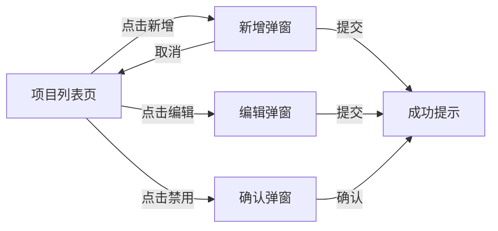
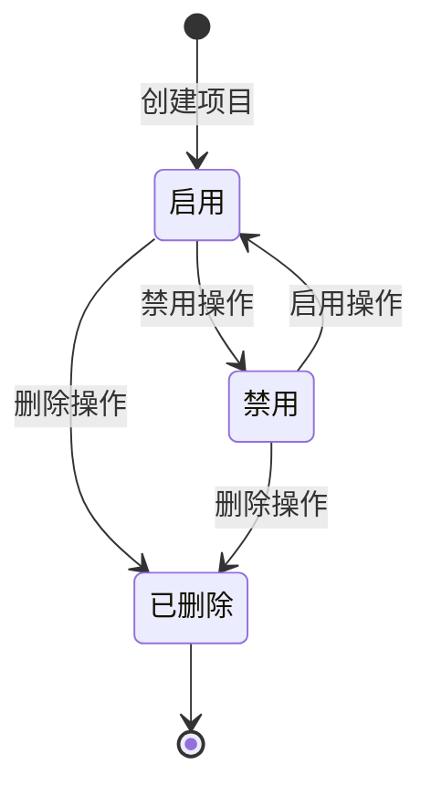

# 模块：项目管理

## 1. 功能概述

- **功能描述**：管理接入权限中心的项目，每个项目拥有独立的权限点和角色空间
- **使用场景**：当有新的业务系统需要接入权限中心时，管理员创建项目并配置基本信息

## 2. 用户故事 (User Stories)

- 作为 **系统管理员**，我想要 **创建项目**，以便 **业务系统能接入权限中心**
- 作为 **系统管理员**，我想要 **编辑项目信息**，以便 **更新项目的配置**
- 作为 **系统管理员**，我想要 **禁用/启用项目**，以便 **控制项目的访问状态**
- 作为 **系统管理员**，我想要 **查看项目列表**，以便 **了解所有接入的系统**

## 3. 功能详细说明

### 3.1 核心逻辑 (Logic)

#### 业务规则 1：项目创建

- **触发条件**：管理员在管理后台点击"新增项目"按钮
- **处理逻辑**：
  1. 校验项目编码唯一性（全局唯一）
  2. 校验项目名称唯一性
  3. 创建项目记录
- **预期结果**：项目创建成功，可进行后续权限配置
- **异常处理**：项目编码/名称已存在时提示错误

#### 业务规则 2：项目禁用

- **触发条件**：管理员点击"禁用"按钮
- **处理逻辑**：
  1. 检查是否有用户正在使用该项目下的权限
  2. 禁用项目（软删除或状态变更）
- **预期结果**：项目禁用后，该项目下的所有权限判断返回无权限
- **异常处理**：禁用失败时回滚状态

#### 业务规则 3：项目删除

- **触发条件**：管理员点击"删除"按钮
- **处理逻辑**：
  1. 检查项目下是否有权限点
  2. 检查项目下是否有角色
  3. 检查项目下是否有用户授权
  4. 级联删除或阻止删除
- **预期结果**：项目及其关联数据被清理
- **异常处理**：存在关联数据时提示需先清理

### 3.2 交互需求 (UI/UX)



- **页面元素**：
  - 搜索框：支持按项目编码、名称搜索
  - 新增按钮
  - 项目列表表格：编码、名称、状态、创建时间、操作
  - 操作列：编辑、禁用/启用、删除

## 4. 数据模型需求 (Data Model)

### project 表

| 字段名 | 类型 | 必填 | 说明 | 示例 |
|--------|------|------|------|------|
| id | Long | 是 | 主键ID | 1 |
| code | String | 是 | 项目编码（全局唯一） | "ORDER_SYSTEM" |
| name | String | 是 | 项目名称 | "订单系统" |
| description | String | 否 | 项目描述 | "订单管理相关权限" |
| status | Integer | 是 | 状态：1=启用，0=禁用 | 1 |
| createdAt | DateTime | 是 | 创建时间 | 2026-03-14 10:00:00 |
| updatedAt | DateTime | 是 | 更新时间 | 2026-03-14 10:00:00 |
| deleted | Integer | 是 | 逻辑删除：0=未删除，1=已删除 | 0 |

### 索引设计

- PRIMARY KEY: id
- UNIQUE INDEX: code (WHERE deleted = 0)
- INDEX: name, status

## 5. 接口需求 (API Requirements)

### 5.1 创建项目

- **接口路径**：`POST /api/v1/permission/project`
- **输入参数**：

| 参数名 | 类型 | 必填 | 说明 | 校验规则 |
|--------|------|------|------|----------|
| code | String | 是 | 项目编码 | 2-50字符，仅允许大写字母、下划线、数字 |
| name | String | 是 | 项目名称 | 2-100字符 |
| description | String | 否 | 项目描述 | 最大500字符 |

- **输出结果**：
```json
{
  "code": 200,
  "message": "操作成功",
  "data": {
    "id": 1,
    "code": "ORDER_SYSTEM",
    "name": "订单系统"
  }
}
```

- **校验逻辑**：
  - code 全局唯一性校验
  - name 全局唯一性校验

### 5.2 更新项目

- **接口路径**：`PUT /api/v1/permission/project/{id}`
- **输入参数**：

| 参数名 | 类型 | 必填 | 说明 |
|--------|------|------|------|
| id | Long | 是 | 项目ID（Path参数） |
| name | String | 是 | 项目名称 |
| description | String | 否 | 项目描述 |

- **输出结果**：更新后的项目信息
- **校验逻辑**：
  - 项目必须存在
  - name 不能与其他项目重复

### 5.3 获取项目详情

- **接口路径**：`GET /api/v1/permission/project/{id}`
- **输入参数**：id（Path参数）
- **输出结果**：项目详细信息

### 5.4 获取项目列表

- **接口路径**：`GET /api/v1/permission/project/list`
- **输入参数**：

| 参数名 | 类型 | 必填 | 说明 |
|--------|------|------|------|
| code | String | 否 | 项目编码（模糊搜索） |
| name | String | 否 | 项目名称（模糊搜索） |
| status | Integer | 否 | 状态筛选 |
| pageNum | Integer | 否 | 页码，默认1 |
| pageSize | Integer | 否 | 每页数量，默认10 |

- **输出结果**：分页的项目列表
- **筛选规则**：不选择状态时默认查询全部

### 5.5 启用/禁用项目

- **接口路径**：`PUT /api/v1/permission/project/{id}/status`
- **输入参数**：

| 参数名 | 类型 | 必填 | 说明 |
|--------|------|------|------|
| id | Long | 是 | 项目ID（Path参数） |
| status | Integer | 是 | 目标状态：1=启用，0=禁用 |

- **输出结果**：操作结果

### 5.6 删除项目

- **接口路径**：`DELETE /api/v1/permission/project/{id}`
- **输入参数**：id（Path参数）
- **输出结果**：操作结果
- **校验逻辑**：
  - 项目下无权限点
  - 项目下无角色
  - 项目下无用户授权

## 6. 状态机



## 7. 验收标准 (AC)

- [ ] 可以创建项目，项目编码和名称校验正确
- [ ] 项目编码全局唯一，重复时提示错误
- [ ] 可以编辑项目信息
- [ ] 可以禁用/启用项目
- [ ] 禁用后该项目下的权限判断返回无权限
- [ ] 可以删除项目（无关联数据时）
- [ ] 有关联数据时删除提示需先清理
- [ ] 项目列表支持分页和搜索
- [ ] 状态筛选为空时查询全部
