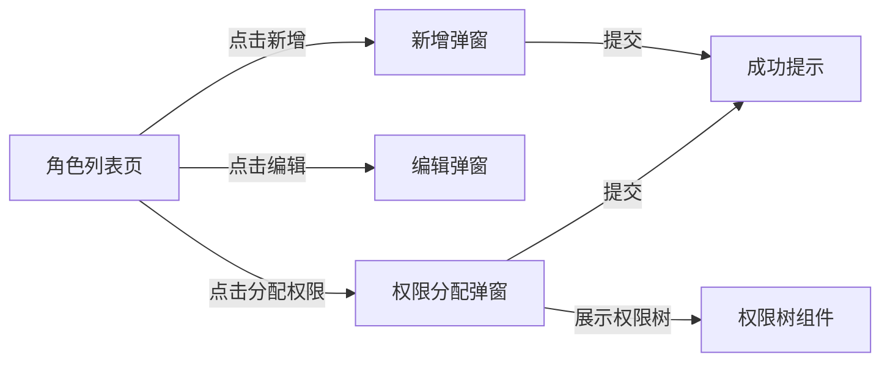
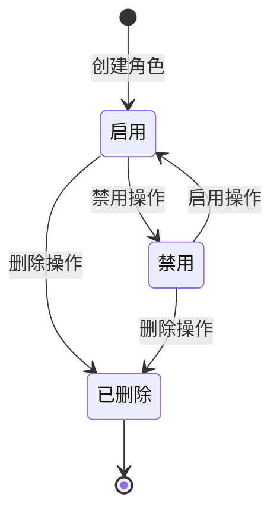

# 模块：角色管理

## 1. 功能概述

- **功能描述**：管理角色的 CRUD，支持为角色分配权限点
- **使用场景**：管理员创建角色并分配权限，用户通过获得角色来获得相应权限

## 2. 用户故事 (User Stories)

- 作为 **系统管理员**，我想要 **创建角色**，以便 **批量管理用户权限**
- 作为 **系统管理员**，我想要 **为角色分配权限**，以便 **定义角色拥有的权限集合**
- 作为 **系统管理员**，我想要 **编辑角色**，以便 **更新角色信息**
- 作为 **系统管理员**，我想要 **删除角色**，以便 **清理不需要的角色**
- 作为 **系统管理员**，我想要 **查看角色列表**，以便 **了解所有可用角色**

## 3. 功能详细说明

### 3.1 核心逻辑 (Logic)

#### 业务规则 1：角色创建

- **触发条件**：管理员点击"新增角色"按钮
- **处理逻辑**：
  1. 校验项目是否存在且启用
  2. 校验角色编码在项目内唯一
  3. 创建角色记录
- **预期结果**：角色创建成功
- **异常处理**：项目不存在/编码重复时提示错误

#### 业务规则 2：角色权限分配

- **触发条件**：管理员在角色详情页点击"分配权限"
- **处理逻辑**：
  1. 校验角色是否存在
  2. 校验所有权限点是否属于同一项目
  3. 清除原有权限关联
  4. 创建新的权限关联
- **预期结果**：角色权限更新成功
- **异常处理**：权限点不存在或不属于该项目时提示错误

#### 业务规则 3：角色删除

- **触发条件**：管理员点击"删除"按钮
- **处理逻辑**：
  1. 检查是否有用户拥有此角色
  2. 删除角色权限关联
  3. 删除用户角色关联
  4. 删除角色
- **预期结果**：角色及其关联数据删除成功
- **异常处理**：删除失败时回滚

### 3.2 交互需求 (UI/UX)

- **页面元素**：
  - 项目选择器
  - 搜索框：支持按角色编码、名称搜索
  - 新增按钮
  - 角色列表表格：编码、名称、权限数量、用户数量、状态、操作
  - 操作列：编辑、分配权限、删除
  - 权限分配弹窗：权限树（支持勾选）

## 4. 数据模型需求 (Data Model)

### role 表

| 字段名 | 类型 | 必填 | 说明 | 示例 |
|--------|------|------|------|------|
| id | Long | 是 | 主键ID | 1 |
| projectId | Long | 是 | 所属项目ID | 1 |
| code | String | 是 | 角色编码（项目内唯一） | "ADMIN" |
| name | String | 是 | 角色名称 | "管理员" |
| description | String | 否 | 角色描述 | "系统管理员角色" |
| status | Integer | 是 | 状态：1=启用，0=禁用 | 1 |
| createdAt | DateTime | 是 | 创建时间 | |
| updatedAt | DateTime | 是 | 更新时间 | |
| deleted | Integer | 是 | 逻辑删除 | |

### role_permission 表（角色-权限关联）

| 字段名 | 类型 | 必填 | 说明 | 示例 |
|--------|------|------|------|------|
| id | Long | 是 | 主键ID | 1 |
| roleId | Long | 是 | 角色ID | 1 |
| permissionId | Long | 是 | 权限点ID | 1 |
| createdAt | DateTime | 是 | 创建时间 | |

## 5. 接口需求 (API Requirements)

### 5.1 创建角色
- **接口路径**：`POST /api/v1/permission/role`
- **输入参数**：

| 参数名 | 类型 | 必填 | 说明 |
|--------|------|------|------|
| projectId | Long | 是 | 项目ID |
| code | String | 是 | 角色编码 |
| name | String | 是 | 角色名称 |
| description | String | 否 | 描述 |

- **输出结果**：创建的角色信息
- **校验逻辑**：项目存在、编码项目内唯一

### 5.2 更新角色
- **接口路径**：`PUT /api/v1/permission/role/{id}`
- **输入参数**：

| 参数名 | 类型 | 必填 | 说明 |
|--------|------|------|------|
| id | Long | 是 | 角色ID（Path参数） |
| name | String | 是 | 角色名称 |
| description | String | 否 | 描述 |
| status | Integer | 否 | 状态 |

- **输出结果**：更新后的角色信息

### 5.3 获取角色详情
- **接口路径**：`GET /api/v1/permission/role/{id}`
- **输出结果**：角色详细信息（包含权限列表）

### 5.4 获取角色列表
- **接口路径**：`GET /api/v1/permission/role/list`
- **输入参数**：

| 参数名 | 类型 | 必填 | 说明 |
|--------|------|------|------|
| projectId | Long | 是 | 项目ID |
| code | String | 否 | 角色编码（模糊搜索） |
| name | String | 否 | 角色名称（模糊搜索） |
| status | Integer | 否 | 状态筛选 |
| pageNum | Integer | 否 | 页码 |
| pageSize | Integer | 否 | 每页数量 |

- **输出结果**：分页的角色列表
- **筛选规则**：不选择状态时默认查询全部

### 5.5 分配角色权限
- **接口路径**：`POST /api/v1/permission/role/{id}/permissions`
- **输入参数**：

| 参数名 | 类型 | 必填 | 说明 |
|--------|------|------|------|
| id | Long | 是 | 角色ID（Path参数） |
| permissionIds | List&lt;Long&gt; | 是 | 权限点ID列表 |

- **输出结果**：操作结果
- **校验逻辑**：
  - 所有权限点必须属于同一项目
  - 权限点必须存在且启用

### 5.6 获取角色的权限列表
- **接口路径**：`GET /api/v1/permission/role/{id}/permissions`
- **输出结果**：权限点列表

### 5.7 删除角色
- **接口路径**：`DELETE /api/v1/permission/role/{id}`
- **输出结果**：操作结果
- **级联删除**：
  - 删除 role_permission 关联
  - 删除 user_role 关联

## 6. 状态机

## 7. 验收标准 (AC)

- [ ] 可以创建角色
- [ ] 角色编码在项目内唯一
- [ ] 可以为角色分配权限
- [ ] 分配权限时校验权限是否属于同一项目
- [ ] 权限分配支持树形展示（勾选）
- [ ] 可以编辑角色信息
- [ ] 可以禁用/启用角色
- [ ] 禁用后用户拥有该角色时鉴权不通过
- [ ] 可以删除角色
- [ ] 删除角色时级联删除权限关联和用户关联
