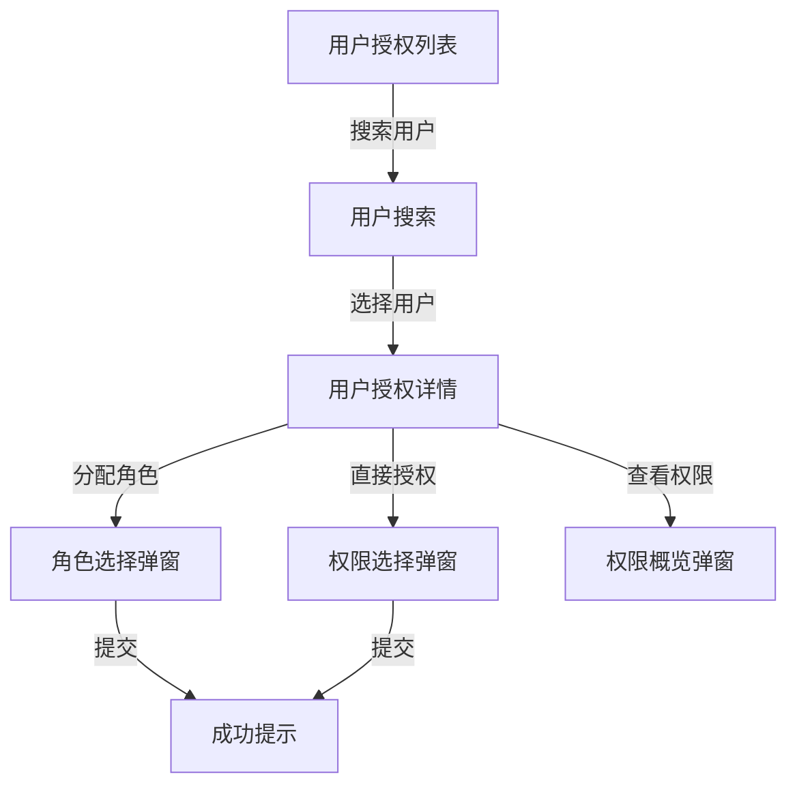

# 模块：用户授权管理

## 1. 功能概述

- **功能描述**：管理用户的角色授权和直接权限授权（ALLOW/DENY）
- **使用场景**：管理员为用户分配角色，或直接授予/排除特定权限

## 2. 用户故事 (User Stories)

- 作为 **系统管理员**，我想要 **为用户分配角色**，以便 **用户能获得角色对应的权限**
- 作为 **系统管理员**，我想要 **移除用户的角色**，以便 **撤销用户的角色权限**
- 作为 **系统管理员**，我想要 **直接为用户授予权限(ALLOW)**，以便 **灵活授予特定权限**
- 作为 **系统管理员**，我想要 **直接排除用户权限(DENY)**，以便 **精确控制用户不能访问的权限**
- 作为 **系统管理员**，我想要 **查看用户的权限概览**，以便 **了解用户拥有的所有权限来源**

## 3. 功能详细说明

### 3.1 核心逻辑 (Logic)

#### 业务规则 1：用户角色授权

- **触发条件**：管理员在用户授权页面点击"分配角色"
- **处理逻辑**：
  1. 校验用户是否存在
  2. 校验项目是否存在
  3. 校验角色是否属于该项目
  4. 检查是否已授权过该角色（幂等）
  5. 创建用户角色关联
- **预期结果**：用户获得角色对应的所有权限
- **异常处理**：用户/项目/角色不存在时提示错误

#### 业务规则 2：用户直接权限 - ALLOW

- **触发条件**：管理员点击"直接授权"并选择 ALLOW 类型
- **处理逻辑**：
  1. 校验用户、项目、权限点存在
  2. 如果已有 DENY 记录，提示冲突
  3. 创建 ALLOW 类型的直接权限记录
- **预期结果**：用户获得该权限（优先级高于角色权限）
- **异常处理**：已有 DENY 时提示冲突

#### 业务规则 3：用户直接权限 - DENY

- **触发条件**：管理员点击"直接授权"并选择 DENY 类型
- **处理逻辑**：
  1. 校验用户、项目、权限点存在
  2. 创建 DENY 类型的直接权限记录
- **预期结果**：用户被禁止访问该权限（最高优先级）
- **异常处理**：无

#### 业务规则 4：权限优先级规则

```
用户直接 DENY > 用户直接 ALLOW > 角色权限
```

- **DENY 优先级最高**：即使用户有角色包含该权限，只要设置了 DENY，就拒绝访问
- **ALLOW 优先级次之**：用户直接 ALLOW 覆盖角色权限
- **角色权限最低**：通过角色获得的权限

### 3.2 交互需求 (UI/UX)



- **页面元素**：
  - 用户搜索框
  - 项目选择器
  - 用户授权详情页：
    - 已分配角色列表（可移除）
    - 直接权限列表（ALLOW/DENY标识，可移除）
    - 权限概览按钮
  - 分配角色弹窗：角色列表（多选）
  - 直接授权弹窗：权限树 + 类型选择（ALLOW/DENY）
  - 权限概览弹窗：展示所有权限及来源

## 4. 数据模型需求 (Data Model)

### user_role 表（用户-角色关联）

| 字段名 | 类型 | 必填 | 说明 | 示例 |
|--------|------|------|------|------|
| id | Long | 是 | 主键ID | 1 |
| userId | Long | 是 | 用户ID | 1001 |
| projectId | Long | 是 | 项目ID | 1 |
| roleId | Long | 是 | 角色ID | 1 |
| createdAt | DateTime | 是 | 创建时间 | |
| deleted | Integer | 是 | 逻辑删除 | |

**唯一约束**：`(userId, projectId, roleId, deleted)`

### user_permission 表（用户直接权限）

| 字段名 | 类型 | 必填 | 说明 | 示例 |
|--------|------|------|------|------|
| id | Long | 是 | 主键ID | 1 |
| userId | Long | 是 | 用户ID | 1001 |
| projectId | Long | 是 | 项目ID | 1 |
| permissionId | Long | 是 | 权限点ID | 1 |
| type | String | 是 | 类型：ALLOW / DENY | "ALLOW" |
| createdAt | DateTime | 是 | 创建时间 | |
| deleted | Integer | 是 | 逻辑删除 | |

**唯一约束**：`(userId, projectId, permissionId, deleted)`

## 5. 接口需求 (API Requirements)

### 5.1 为用户分配角色

- **接口路径**：`POST /api/v1/permission/user/role`
- **输入参数**：

| 参数名 | 类型 | 必填 | 说明 |
|--------|------|------|------|
| userId | Long | 是 | 用户ID |
| projectId | Long | 是 | 项目ID |
| roleIds | List&lt;Long&gt; | 是 | 角色ID列表（批量） |

- **输出结果**：操作结果
- **校验逻辑**：
  - 角色必须属于该项目
  - 已授权的角色幂等处理

### 5.2 移除用户角色

- **接口路径**：`DELETE /api/v1/permission/user/role`
- **输入参数**：

| 参数名 | 类型 | 必填 | 说明 |
|--------|------|------|------|
| userId | Long | 是 | 用户ID |
| projectId | Long | 是 | 项目ID |
| roleId | Long | 是 | 角色ID |

- **输出结果**：操作结果

### 5.3 为用户授予直接权限

- **接口路径**：`POST /api/v1/permission/user/permission`
- **输入参数**：

| 参数名 | 类型 | 必填 | 说明 |
|--------|------|------|------|
| userId | Long | 是 | 用户ID |
| projectId | Long | 是 | 项目ID |
| permissionIds | List&lt;Long&gt; | 是 | 权限点ID列表 |
| type | String | 是 | 类型：ALLOW / DENY |

- **输出结果**：操作结果
- **校验逻辑**：
  - 权限点必须属于该项目
  - 设置 DENY 时检查是否已有 ALLOW（提示冲突，允许覆盖）

### 5.4 移除用户直接权限

- **接口路径**：`DELETE /api/v1/permission/user/permission`
- **输入参数**：

| 参数名 | 类型 | 必填 | 说明 |
|--------|------|------|------|
| userId | Long | 是 | 用户ID |
| projectId | Long | 是 | 项目ID |
| permissionId | Long | 是 | 权限点ID |

- **输出结果**：操作结果

### 5.5 获取用户角色列表

- **接口路径**：`GET /api/v1/permission/user/{userId}/roles`
- **输入参数**：

| 参数名 | 类型 | 必填 | 说明 |
|--------|------|------|------|
| userId | Long | 是 | 用户ID（Path参数） |
| projectId | Long | 是 | 项目ID |

- **输出结果**：用户在该项目下的角色列表

### 5.6 获取用户直接权限列表

- **接口路径**：`GET /api/v1/permission/user/{userId}/permissions`
- **输入参数**：

| 参数名 | 类型 | 必填 | 说明 |
|--------|------|------|------|
| userId | Long | 是 | 用户ID（Path参数） |
| projectId | Long | 是 | 项目ID |

- **输出结果**：用户在该项目下的直接权限列表

### 5.7 获取用户权限概览

- **接口路径**：`GET /api/v1/permission/user/{userId}/permission-overview`
- **输入参数**：

| 参数名 | 类型 | 必填 | 说明 |
|--------|------|------|------|
| userId | Long | 是 | 用户ID（Path参数） |
| projectId | Long | 是 | 项目ID |

- **输出结果**：
```json
{
  "code": 200,
  "data": {
    "permissions": [
      {
        "code": "ORDER_VIEW",
        "name": "订单查看",
        "source": "ROLE",
        "sourceName": "订单管理员",
        "effect": "ALLOW"
      },
      {
        "code": "ORDER_DELETE",
        "name": "订单删除",
        "source": "DIRECT",
        "sourceName": "直接授权",
        "effect": "DENY"
      }
    ]
  }
}
```

## 6. 权限优先级示意

```
┌─────────────────────────────────────────────────────────────┐
│                     用户权限判断流程                           │
├─────────────────────────────────────────────────────────────┤
│  1. 检查用户直接权限 (user_permission)                         │
│     ├─ 存在 DENY → 拒绝访问 (最高优先级)                        │
│     └─ 存在 ALLOW → 允许访问                                  │
│                                                              │
│  2. 检查用户角色权限 (user_role → role_permission)            │
│     └─ 存在权限 → 允许访问                                    │
│                                                              │
│  3. 无任何权限 → 拒绝访问                                     │
└─────────────────────────────────────────────────────────────┘
```

## 7. 验收标准 (AC)
- [ ] 可以为用户分配角色
- [ ] 分配角色时校验角色是否属于该项目
- [ ] 已分配的角色不会重复创建（幂等）
- [ ] 可以移除用户的角色
- [ ] 可以为用户授予直接 ALLOW 权限
- [ ] 可以为用户授予直接 DENY 权限
- [ ] DENY 权限优先级最高，覆盖角色权限
- [ ] ALLOW 权限优先级高于角色权限
- [ ] 可以移除用户的直接权限
- [ ] 可以查看用户的权限概览（显示来源和效果）
