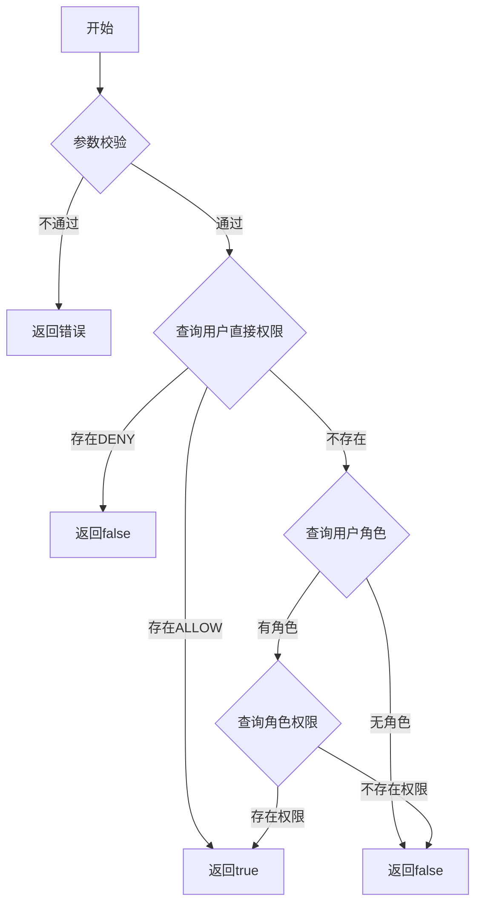

# 模块：统一鉴权

## 1. 功能概述

- **功能描述**：提供统一的权限校验接口，供业务系统调用判断用户是否有权限访问某资源
- **使用场景**：业务系统在用户访问功能时，调用鉴权接口判断用户权限

- **多项目隔离**：鉴权必须指定 projectId，按项目维度隔离

## 2. 用户故事 (User Stories)
- 作为 **业务系统**，我想要 **调用单个权限校验接口**，以便 **判断用户是否有某个权限**
- 作为 **业务系统**，我想要 **调用批量权限校验接口**，以便 **一次性判断多个权限**
- 作为 **业务系统**，我想要 **获取用户所有权限列表**，以便 **前端进行按钮级权限控制**

## 3. 功能详细说明

### 3.1 核心逻辑 (Logic)

#### 业务规则 1：权限判断优先级

```
判断顺序（优先级从高到低）：
1. 用户直接 DENY → 拒绝（最高优先级）
2. 用户直接 ALLOW → 允许
3. 用户角色权限 → 允许
4. 都没有 → 拒绝
```

#### 业务规则 2：单权限校验

- **触发条件**：业务系统调用鉴权接口
- **处理逻辑**：
  1. 校验 userId、projectId、permissionCode 不为空
  2. 查询用户直接权限（user_permission）
     - 存在 DENY → 返回 false
     - 存在 ALLOW → 返回 true
  3. 查询用户角色（user_role） → 获取所有角色ID
  4. 查询角色权限（role_permission）
     - 存在权限 → 返回 true
  5. 返回 false
- **预期结果**：返回用户是否有权限
- **异常处理**：参数为空时返回错误
#### 业务规则 3：批量权限校验
- **触发条件**：业务系统需要判断多个权限
- **处理逻辑**：
  1. 对每个权限码执行单权限校验逻辑
  2. 返回每个权限码的校验结果
- **预期结果**：返回权限码与校验结果的映射
#### 业务规则 4：项目隔离
- 所有鉴权必须指定 projectId
- 只查询该项目下的权限点和角色
- 不同项目的权限完全隔离

### 3.2 交互需求 (UI/UX)
- 本模块为纯后端接口，无前端界面
- 可提供测试页面用于验证鉴权逻辑
```mermaid
graph LR
    A[业务系统] -- 萃取权限列表 --> B[权限中心]
    B -- 返回权限列表 --> A
    A -- 苦访问功能 + --> C{鉴权接口]
    c -- 返回 true/false --> A
```

## 4. 数据模型需求 (Data Model)
- 本模块主要查询以下数据表：
  - `user_permission`：用户直接权限
  - `user_role`：用户角色关联
  - `role_permission`：角色权限关联
  - `role`：角色信息（检查状态）
  - `permission`：权限点信息（检查状态）
  - `project`：项目信息（检查状态）
## 5. 接口需求 (API Requirements)
### 5.1 单权限校验
- **接口路径**：`GET /api/v1/permission/auth/check`
- **输入参数**：
| 参数名 | 类型 | 必填 | 说明 |
|--------|------|------|------|
| userId | Long | 是 | 用户ID |
| projectId | Long | 是 | 项目ID |
| permissionCode | String | 是 | 权限编码 |
- **输出结果**：
```json
{
  "code": 200,
  "data": {
    "hasPermission": true
  }
}
```
### 5.2 批量权限校验
- **接口路径**：`POST /api/v1/permission/auth/batch-check`
- **输入参数**:
| 参数名 | 类型 | 必填 | 说明 |
|--------|------|------|------|
| userId | Long | 是 | 用户ID |
| projectId | Long | 是 | 项目ID |
| permissionCodes | List&lt;String&gt; | 是 | 权限编码列表 |
- **输出结果**:
```json
{
  "code": 200,
  "data": {
    "results": {
      "ORDER_VIEW": true,
      "ORDER_CREATE": true,
      "ORDER_DELETE": false
    }
  }
}
```
### 5.3 获取用户权限列表
- **接口路径**：`GET /api/v1/permission/auth/user-permissions`
- **输入参数**:
| 参数名 | 类型 | 必填 | 说明 |
|--------|------|------|------|
| userId | Long | 是 | 用户ID |
| projectId | Long | 是 | 项目ID |
- **输出结果**:
```json
{
  "code": 200,
  "data": {
    "permissions": [
      {
        "code": "ORDER_VIEW",
        "name": "订单查看",
        "type": "MENU"
      },
      {
        "code": "ORDER_CREATE",
        "name": "订单创建",
        "type": "ACTION"
      }
    ]
  }
}
```
- **说明**：只返回有效的 ALLOW 权限（排除 DENY 的权限）
### 5.4 权限来源解释（可选）
- **接口路径**：`GET /api/v1/permission/auth/explain`
- **输入参数**:
| 参数名 | 类型 | 必填 | 说明 |
|--------|------|------|------|
| userId | Long | 是 | 用户ID |
| projectId | Long | 是 | 项目ID |
| permissionCode | String | 是 | 权限编码 |
- **输出结果**:
```json
{
  "code": 200,
  "data": {
    "hasPermission": true,
    "sources": [
      {
        "type": "ROLE",
        "name": "订单管理员",
        "effect": "ALLOW"
      }
    ]
  }
}
```
## 6. 权限判断流程图

## 7. 性能要求
| 指标 | 要求 |
|------|------|
| 单次鉴权响应时间 | P99 < 50ms |
| 批量鉴权响应时间 | P99 < 100ms |
| 并发 QPS | > 1000 |
### 7.1 缓存策略（可选）
- 用户权限列表缓存：TTL 5分钟
- 缓存 Key：`permission:user:{userId}:project:{projectId}`
- 权限变更时清除缓存
## 8. 验收标准 (AC)
- [ ] 单权限校验接口正确判断权限
- [ ] DENY 权限优先级最高
- [ ] ALLOW 权限优先级高于角色权限
- [ ] 批量权限校验接口正确返回每个权限结果
- [ ] 获取用户权限列表只返回有效权限
- [ ] 鉴权按 projectId 隔离
- [ ] 项目禁用后鉴权返回无权限
- [ ] 权限点禁用后鉴权返回无权限
- [ ] 角色禁用后不参与鉴权
