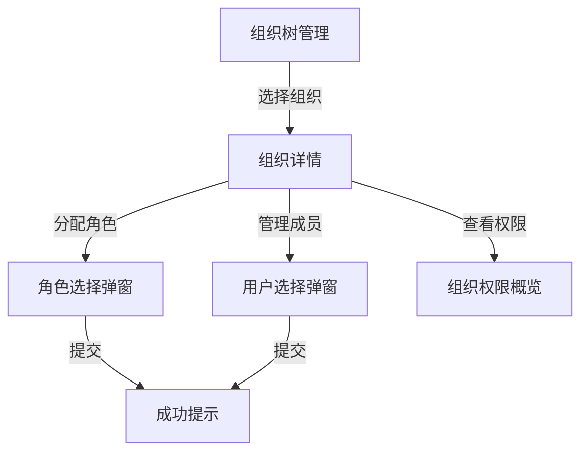

```
# 模块：组织权限

## 1. 功能概述

- **功能描述**：支持按组织维度管理权限，将权限/角色与组织（部门）关联，实现组织级别的权限继承与隔离
- **使用场景**：企业有多级部门结构，需要按部门批量管理权限，子部门自动继承父部门的角色和权限

## 2. 用户故事 (User Stories)

- 作为 **系统管理员**，我想要 **创建和管理组织树**，以便 **反映企业的部门结构**
- 作为 **系统管理员**，我想要 **为组织分配角色**，以便 **组织下所有用户自动获得该角色的权限**
- 作为 **系统管理员**，我想要 **查看组织的权限概览**，以便 **了解某个部门拥有的所有权限**
- 作为 **系统管理员**，我想要 **查看用户的组织权限来源**，以便 **知道用户的权限是从哪个组织继承来的**
- 作为 **业务系统**，我想要 **鉴权时自动考虑组织权限**，以便 **用户通过所属组织获得的权限也能被识别**

## 3. 功能详细说明

### 3.1 核心逻辑 (Logic)

#### 业务规则 1：组织树管理

- **触发条件**：管理员在组织管理页面进行 CRUD 操作
- **处理逻辑**：
  1. 组织支持树形结构（通过 parentId 关联）
  2. 支持创建、编辑、删除、查询组织
  3. 删除组织前检查是否有子组织和关联的用户/角色
- **预期结果**：维护完整的组织树
- **异常处理**：存在子组织或关联数据时禁止删除

#### 业务规则 2：组织-角色关联

- **触发条件**：管理员为组织分配角色
- **处理逻辑**：
  1. 校验组织和角色是否存在且启用
  2. 创建组织-角色关联记录（幂等）
  3. 组织下所有用户自动获得该角色的权限
- **预期结果**：组织下的用户可通过组织角色获得权限
- **异常处理**：组织/角色不存在或已禁用时提示错误

#### 业务规则 3：用户-组织关联

- **触发条件**：管理员将用户加入组织
- **处理逻辑**：
  1. 校验用户ID和组织是否存在
  2. 创建用户-组织关联记录（幂等）
  3. 用户自动获得该组织及其所有上级组织的角色权限
- **预期结果**：用户通过组织获得权限
- **异常处理**：重复关联时幂等处理

#### 业务规则 4：组织权限继承

- **继承规则**：子组织继承父组织的角色
- **鉴权时**：查找用户所属的所有组织（含上级组织链），汇总所有组织角色进行鉴权
- **优先级**：用户直接 DENY > 用户直接 ALLOW > 用户直接角色权限 > 组织角色权限 > 默认拒绝

### 3.2 交互需求 (UI/UX)



- **页面元素**：
  - 左侧组织树
  - 右侧组织详情（基本信息 + 已分配角色列表 + 成员列表）
  - 角色选择弹窗
  - 用户选择弹窗

## 4. 数据模型需求 (Data Model)

### organization 表（组织表）

| 字段名 | 类型 | 必填 | 说明 | 示例 |
|--------|------|------|------|------|
| id | Long | 是 | 主键ID | 1 |
| code | String(64) | 是 | 组织编码，全局唯一 | "TECH_DEPT" |
| name | String(128) | 是 | 组织名称 | "技术部" |
| parentId | Long | 否 | 父组织ID，NULL表示顶级 | 1 |
| sortOrder | Integer | 否 | 同级排序号 | 1 |
| status | String(16) | 是 | 状态：ENABLED/DISABLED | "ENABLED" |
| description | String(256) | 否 | 描述 | "技术研发部门" |

**唯一约束**：`(code, deleted)`

### org_role 表（组织-角色关联表）

| 字段名 | 类型 | 必填 | 说明 | 示例 |
|--------|------|------|------|------|
| id | Long | 是 | 主键ID | 1 |
| orgId | Long | 是 | 组织ID | 1 |
| roleId | Long | 是 | 角色ID | 1 |

**唯一约束**：`(org_id, role_id, deleted)`

### user_org 表（用户-组织关联表）

| 字段名 | 类型 | 必填 | 说明 | 示例 |
|--------|------|------|------|------|
| id | Long | 是 | 主键ID | 1 |
| userId | String(64) | 是 | 用户ID | "user001" |
| orgId | Long | 是 | 组织ID | 1 |

**唯一约束**：`(user_id, org_id, deleted)`

## 5. 接口需求 (API Requirements)

### 5.1 创建组织

- **接口路径**：`POST /organizations`
- **输入参数**：

| 参数名 | 类型 | 必填 | 说明 |
|--------|------|------|------|
| code | String | 是 | 组织编码 |
| name | String | 是 | 组织名称 |
| parentId | Long | 否 | 父组织ID |
| sortOrder | Integer | 否 | 排序号 |
| description | String | 否 | 描述 |

- **输出结果**：组织详情

### 5.2 编辑组织

- **接口路径**：`PUT /organizations/{id}`
- **输入参数**：name、parentId、sortOrder、status、description
- **输出结果**：组织详情

### 5.3 删除组织

- **接口路径**：`DELETE /organizations/{id}`
- **校验逻辑**：存在子组织、关联角色、关联用户时禁止删除

### 5.4 查询组织树

- **接口路径**：`GET /organizations/tree`
- **输出结果**：组织树形结构

### 5.5 为组织分配角色

- **接口路径**：`POST /organizations/{orgId}/roles`
- **输入参数**：roleIds（角色ID列表）

### 5.6 移除组织角色

- **接口路径**：`DELETE /organizations/{orgId}/roles/{roleId}`

### 5.7 查询组织角色列表

- **接口路径**：`GET /organizations/{orgId}/roles`

### 5.8 将用户加入组织

- **接口路径**：`POST /organizations/{orgId}/members`
- **输入参数**：userIds（用户ID列表）

### 5.9 将用户移出组织

- **接口路径**：`DELETE /organizations/{orgId}/members/{userId}`

### 5.10 查询组织成员列表

- **接口路径**：`GET /organizations/{orgId}/members`

## 6. 鉴权优先级更新

```
┌─────────────────────────────────────────────────────────────┐
│                     用户权限判断流程（含组织权限）               │
├─────────────────────────────────────────────────────────────┤
│  1. 检查用户直接权限 (user_permission)                         │
│     ├─ 存在 DENY → 拒绝访问 (最高优先级)                        │
│     └─ 存在 ALLOW → 允许访问                                  │
│                                                              │
│  2. 检查用户直接角色权限 (user_role → role_permission)          │
│     └─ 存在权限 → 允许访问                                    │
│                                                              │
│  3. 检查用户组织角色权限 (user_org → org_role → role_permission)│
│     └─ 存在权限 → 允许访问（含上级组织继承）                     │
│                                                              │
│  4. 无任何权限 → 拒绝访问                                     │
└─────────────────────────────────────────────────────────────┘
```

## 7. 验收标准 (AC)

- [ ] 可以创建、编辑、删除组织
- [ ] 组织支持树形结构展示
- [ ] 可以为组织分配和移除角色
- [ ] 可以将用户加入和移出组织
- [ ] 用户通过组织获得的角色权限在鉴权时生效
- [ ] 子组织继承父组织的角色权限
- [ ] 删除组织前校验关联数据
- [ ] 组织编码全局唯一
- [ ] 鉴权结果能解释权限来源为"组织角色"
```

