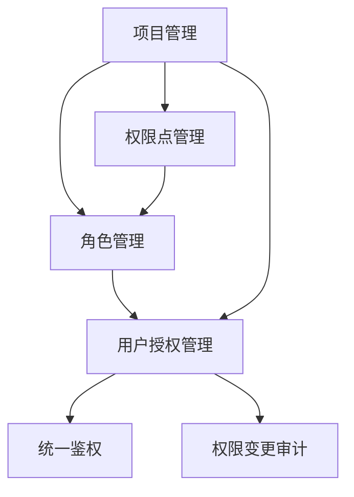
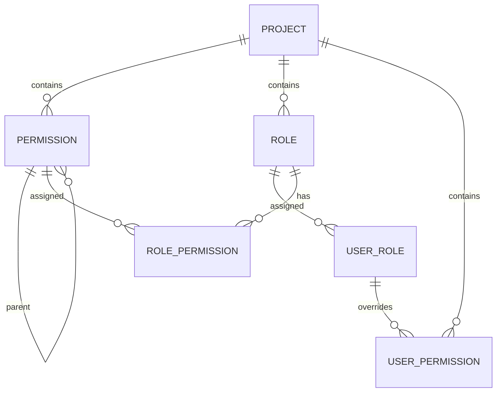

# 模块：权限管理系统总览

> 本文档作为权限管理系统的 BRD（业务需求文档）总览，各子模块的详细 PRD 见关联文档。

## 1. 系统概述

### 1.1 功能描述

建设统一权限中心（Permission Center），为多个业务系统提供统一的权限管理与鉴权能力。

**核心设计理念**：
- **仅权限点模型**：权限中心只管理 `permissionCode`，不直接管理菜单、页面或资源实体
- **多项目隔离**：支持按 `projectId` 维度的权限隔离
- **灵活授权**：支持角色授权 + 用户直接授权(ALLOW) + 用户直接排除权限(DENY)

### 1.2 使用场景

| 场景 | 描述 |
|------|------|
| 业务系统接入 | 新业务系统接入权限中心，获取统一鉴权能力 |
| 权限配置 | 管理员配置角色、权限点、用户授权关系 |
| 权限校验 | 业务系统调用鉴权接口，判断用户是否有权限访问某资源 |
| 权限审计 | 查看用户权限来源、权限变更历史 |

### 1.3 系统边界

```
┌─────────────────────────────────────────────────────────────┐
│                      权限管理系统                              │
│  ┌─────────┐ ┌─────────┐ ┌─────────┐ ┌─────────┐ ┌─────────┐ │
│  │项目管理 │ │权限点管理│ │角色管理 │ │用户授权 │ │统一鉴权 │ │
│  └─────────┘ └─────────┘ └─────────┘ └─────────┘ └─────────┘ │
│                           │                                   │
│                    ┌──────┴──────┐                           │
│                    │权限变更审计  │                           │
│                    └─────────────┘                           │
└─────────────────────────────────────────────────────────────┘
         │                                    │
         ▼                                    ▼
   ┌─────────────┐                    ┌─────────────┐
   │ 业务系统 A   │                    │ 业务系统 B   │
   └─────────────┘                    └─────────────┘
```

## 2. 用户故事

| 角色 | 故事 |
|------|------|
| 系统管理员 | 作为系统管理员，我想要创建项目并配置权限点，以便业务系统能接入权限中心 |
| 系统管理员 | 作为系统管理员，我想要创建角色并分配权限，以便批量管理用户权限 |
| 系统管理员 | 作为系统管理员，我想要为用户分配角色和直接权限，以便灵活控制用户权限 |
| 业务系统 | 作为业务系统，我想要调用鉴权接口，以便判断用户是否有权限访问某功能 |
| 审计人员 | 作为审计人员，我想要查看权限变更记录，以便追溯权限变更历史 |

## 3. 核心模块划分

### 3.1 模块列表

| 模块 | 说明 | 详细 PRD |
|------|------|----------|
| 项目管理 | 管理接入权限中心的项目 | [项目管理模块.md](./项目管理模块.md) |
| 权限点管理 | 管理权限点的 CRUD、树形结构 | [权限点管理模块.md](./权限点管理模块.md) |
| 角色管理 | 管理角色的 CRUD、权限分配 | [角色管理模块.md](./角色管理模块.md) |
| 用户授权管理 | 管理用户角色授权、用户直接权限 | [用户授权管理模块.md](./用户授权管理模块.md) |
| 统一鉴权 | 提供鉴权接口、权限判断逻辑 | [统一鉴权模块.md](./统一鉴权模块.md) |
| 权限变更审计 | 记录权限变更历史（可选） | [权限变更审计模块.md](./权限变更审计模块.md) |
| 组织权限 | 按组织维度管理权限，支持组织角色继承 | [组织权限模块.md](./06-组织权限模块.md) |

### 3.2 模块依赖关系



## 4. 数据模型总览

### 4.1 实体关系图



### 4.2 核心数据表

| 表名 | 说明 |
|------|------|
| `project` | 项目信息表 |
| `permission` | 权限点表 |
| `role` | 角色表 |
| `role_permission` | 角色-权限关联表 |
| `user_role` | 用户-角色关联表 |
| `user_permission` | 用户直接权限表（支持 ALLOW/DENY） |
| `permission_audit_log` | 权限变更审计日志表 |

## 5. 核心业务规则

### 5.1 权限判断优先级

```
用户直接 DENY > 用户直接 ALLOW > 角色权限
```

**说明**：
1. 如果用户有直接 DENY 权限，则拒绝访问
2. 如果用户有直接 ALLOW 权限，则允许访问
3. 否则检查用户的角色是否有对应权限

### 5.2 多项目隔离规则

- 每个项目有独立的权限点空间
- 每个项目有独立的角色空间
- 用户授权按项目维度隔离
- 鉴权时必须指定 projectId

### 5.3 权限继承规则

- 权限点支持树形结构
- 角色不继承（可扩展）
- 用户拥有角色时，继承角色所有权限

## 6. 接口设计原则

### 6.1 统一响应格式

```json
{
  "code": 200,
  "message": "操作成功",
  "data": {}
}
```

### 6.2 分页响应格式

```json
{
  "code": 200,
  "message": "操作成功",
  "data": {
    "list": [],
    "total": 100,
    "pageNum": 1,
    "pageSize": 10
  }
}
```

### 6.3 接口路径规范

- 所有接口统一前缀：`/api/v1/permission/`
- 按模块划分：`/api/v1/permission/{module}/{action}`

## 7. 非功能需求

### 7.1 性能要求

| 指标 | 要求 |
|------|------|
| 鉴权接口响应时间 | < 50ms (P99) |
| 权限列表查询 | < 200ms (P99) |
| 并发鉴权 QPS | > 1000 |

### 7.2 安全要求

- 所有接口需要身份认证
- 敏感操作记录审计日志
- 权限变更需要操作日志

### 7.3 可扩展性

- 支持缓存策略（Redis）
- 支持水平扩展
- 支持多实例部署

## 8. 验收标准

### 8.1 功能验收

- [ ] 项目管理功能完整可用
- [ ] 权限点 CRUD 及树形结构展示正常
- [ ] 角色 CRUD 及权限分配功能正常
- [ ] 用户角色授权功能正常
- [ ] 用户直接权限(ALLOW/DENY)功能正常
- [ ] 统一鉴权接口功能正常
- [ ] 多项目隔离正确

### 8.2 性能验收

- [ ] 鉴权接口 P99 < 50ms
- [ ] 列表查询 P99 < 200ms

### 8.3 安全验收

- [ ] 所有接口有权限控制
- [ ] 敏感操作有审计日志

## 9. 里程碑计划

| 阶段 | 内容 |
|------|------|
| MVP | 项目管理 + 权限点管理 + 角色管理 + 用户授权 + 统一鉴权 |
| V1.1 | 权限缓存优化 + 批量操作 |
| V1.2 | 权限变更审计 + 权限有效期 |

## 10. 关联文档

- [PRD 规范模板](../../prd-spec.md)
- [后端系分规范](../../be-design-spec.md)
- [编码规范](../../rules/)
