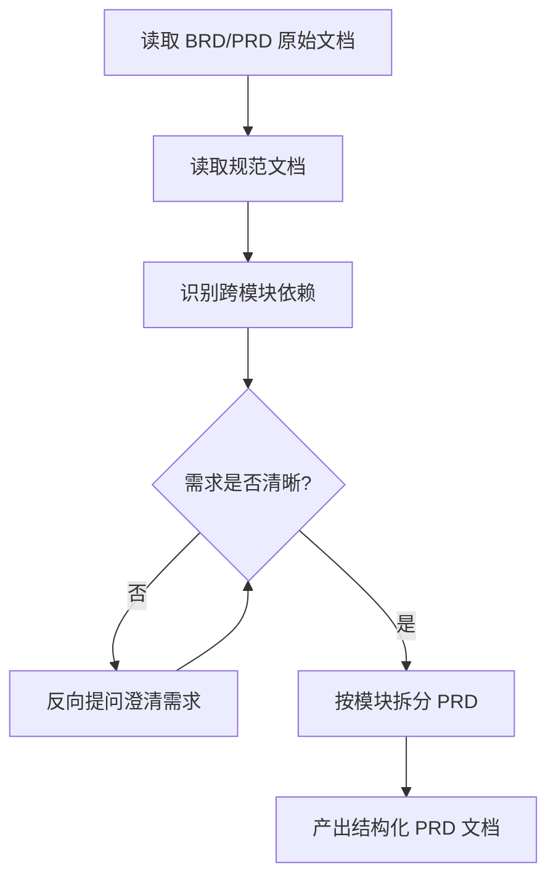

# SDD (Software Design & Development) 开发流程文档

> 本文档定义了权限管理平台项目的 SDD 开发流程，指导团队按照标准化流程完成从需求分析到代码交付的全过程。

---

## 一、流程概述

SDD（Software Design & Development）是一种 AI 辅助增强型软件开发流程，通过在关键环节引入人工评审和自动化工具，提高开发效率和代码质量。

### 核心特点

- **人工评审增强**：在生成技术方案环节增加人工评审节点，确保设计质量
- **渐进式细化**：从 PRD → 系分设计 → AI Plan → 代码实现，逐步细化技术细节
- **质量保障**：在需求分析、方案设计和代码实现环节均有质量卡点
- **自动化工具**：集成规范读取、依赖识别、代码验证等自动化能力

### 流程全景


---

## 二、项目目录结构

```
permission/
├── spec/                         ← 规范与文档根目录
│   ├── docs/                     ← 文档归档
│   │   ├── PRD/                  ← 模块级需求文档（Markdown）
│   │   │   └── 权限管理/         ← 按业务域分目录
│   │   │       ├── 01-项目总览与数据模型.md
│   │   │       ├── 02-权限点管理模块.md
│   │   │       ├── 03-角色管理模块.md
│   │   │       ├── 04-用户授权模块.md
│   │   │       ├── 05-统一鉴权模块.md
│   │   │       ├── 06-前端页面需求.md
│   │   │       └── 07-演示数据与验收标准.md
│   │   └── BE-DESIGN/            ← 系分文档归档
│   │       └── 权限管理/         ← 按业务域分目录
│   │           ├── 00-全局设计与项目规格.md
│   │           ├── 01-权限点管理模块.md
│   │           ├── 02-角色管理模块.md
│   │           ├── 03-用户授权模块.md
│   │           └── 04-统一鉴权模块.md
│   ├── code-spec/                ← 编码规范
│   │   ├── CODE_RULES_SUMMARY.md ← ⭐ 核心规范汇总（最高优先级）
│   │   ├── java-exception-spec.md
│   │   ├── java-package-spec.md
│   │   ├── java-coding-spec.md
│   │   ├── java-logging-spec.md
│   │   ├── java-test-spec.md
│   │   ├── java-security-spec.md
│   │   ├── java-format-spec.md
│   │   └── java-review-spec.md
│   ├── prd-spec.md               ← PRD 编写规范模板
│   ├── be-design-spec.md         ← 系分文档编写规范模板
│   └── SDD-WORKFLOW.md           ← 本文档（SDD 流程定义）
├── plans/                        ← AI Plan 归档
│   ├── 00-基础设施与公共模块.plan.md
│   ├── 01-数据访问层.plan.md
│   ├── 02-权限点管理模块.plan.md
│   ├── 03-角色管理模块.plan.md
│   ├── 04-用户授权模块.plan.md
│   └── 05-统一鉴权模块.plan.md
├── skills/                       ← AI Skill 定义
│   ├── prd-to-sysdesign/
│   ├── java-code-with-spec/
│   └── be-design-spec/
└── README.md
```

---

## 三、核心流程阶段详解

### 3.1 阶段一：需求分析（PRD 结构化）

**对应命令**：`/openspec:proposal`

**输入**：产品需求文档（BRD / PRD 原始稿）

**输出**：结构化模块级 PRD 文档（存放于 `spec/docs/PRD/{业务域}/`）

#### 执行步骤



#### 核心能力

| 能力 | 说明 |
|------|------|
| PRD 结构化转换 | 将自然语言 PRD 转为标准化格式 |
| 规范文档并行读取 | 自动读取编码规范 |
| 跨模块依赖识别 | 识别模块间依赖关系 |
| 需求澄清机制 | 通过反向提问消除需求歧义 |

---

### 3.2 阶段二：系分设计（技术设计方案）

**对应命令**：`/openspec:tech-design`

**输入**：结构化 PRD 文档

**输出**：技术设计文档（存放于 `spec/docs/BE-DESIGN/{业务域}/`）

#### 人工评审要点

- [ ] 数据模型是否合理，是否支持后续扩展
- [ ] 接口设计是否符合 RESTful 规范
- [ ] 错误码是否遵循 6 位编码规范
- [ ] 分层是否清晰：Controller → Manager → Service → Mapper
- [ ] 事务边界是否合理
- [ ] 是否考虑了并发和性能

---

### 3.3 阶段三：AI Plan 生成（任务拆解）

**对应命令**：`/openspec:tasks`

**输入**：经人工评审通过的系分文档

**输出**：AI Plan 文档（存放于 `plans/`）

#### 8 个执行阶段

| 阶段 | 内容 | 依赖 |
|------|------|------|
| 1. 基础设施搭建 | 项目骨架、依赖配置、通用工具类 | 无 |
| 2. 领域模型定义 | DO 实体类、枚举定义、ErrorCode | 阶段 1 |
| 3. 数据访问层 | Mapper 接口 | 阶段 2 |
| 4. 业务逻辑层 | Service 接口与实现、Manager 层 | 阶段 3 |
| 5. 接口层 | Controller、DTO/VO、Converter | 阶段 4 |
| 6. 异常处理 | 全局异常处理器、业务异常类 | 阶段 2 |
| 7. 单元测试 | Service/Manager 层测试 | 阶段 4 |
| 8. 集成测试 | 接口级集成测试 | 阶段 5 |

#### 并行优化

```mermaid
gantt
    title 开发阶段并行编排
    dateFormat X
    axisFormat %s

    section 串行阶段
    基础设施搭建     :a1, 0, 1
    领域模型定义     :a2, after a1, 1

    section 可并行阶段
    数据访问层       :a3, after a2, 1
    异常处理         :a6, after a2, 1

    section 串行阶段
    业务逻辑层       :a4, after a3, 2
    接口层           :a5, after a4, 1

    section 可并行阶段
    单元测试         :a7, after a4, 1
    集成测试         :a8, after a5, 1
```



---

### 3.4 阶段四：代码实现

**对应命令**：`/openspec:implement`

**输入**：AI Plan 文档

**输出**：生产代码 + 单元测试

#### 代码生成顺序

```
ErrorCode 枚举 → DO 实体类 → Mapper 接口 → Service 接口 → Service 实现
→ Manager 层 → DTO/VO → MapStruct Converter → Controller → 全局异常处理器 → 单元测试
```

#### 技术规范自动遵守

| 规范 | 说明 |
|------|------|
| MapStruct | 对象转换必须使用 MapStruct，禁止 `BeanUtils.copyProperties()` |
| jakarta.validation | 参数校验使用 `jakarta.validation.*`，禁止 `javax.validation.*` |
| 逻辑删除 | 使用 `deleted` 字段（0=未删除，1=已删除） |
| 统一响应 | `{code, message, data}` 格式 |
| 分层约束 | Controller → Manager → Service → Mapper，禁止跨层调用 |

---

### 3.5 阶段五：验证与沉淀

**对应命令**：`/openspec:validate`

#### 验证检查清单

| 检查项 | 标准 |
|--------|------|
| 编译 | `mvn clean compile` → BUILD SUCCESS |
| 单元测试 | 100% 通过，覆盖率 ≥ 80% |
| 代码 Review | 无严重问题 |
| 接口联调 | 前后端联调通过 |
| 场景验证 | 演示场景全部通过 |

---

## 四、本项目 SDD 执行进度

| 阶段 | 状态 | 产出物位置 |
|------|------|------------|
| 需求分析（PRD） | ✅ 已完成 | `spec/docs/PRD/权限管理/01~07-*.md` |
| 系分设计 | ✅ 已完成 | `spec/docs/BE-DESIGN/权限管理/00~04-*.md` |
| AI Plan 生成 | ✅ 已完成 | `plans/00~05-*.plan.md` |
| 代码实现 | ⏳ 待执行 | 项目源码目录 |
| 验证与沉淀 | ⏳ 待执行 | 验证报告 |

---

## 五、SDD 流程与 AI Skill 映射

| SDD 阶段 | 对应 AI Skill | Skill 位置 |
|----------|---------------|------------|
| 需求分析 → 系分设计 | prd-to-sysdesign | `skills/prd-to-sysdesign/` |
| 系分设计 | be-design-spec | `skills/be-design-spec/` |
| 代码实现 | java-code-with-spec | `skills/java-code-with-spec/` |

---

## 六、最佳实践

### 6.1 需求分析阶段
- 确保 BRD/PRD 信息完整，避免后期需求变更
- 充分利用反向提问机制澄清不明确的需求
- 重视跨模块依赖识别，提前读取关联模块文档

### 6.2 系分设计阶段
- 认真进行人工评审，重点关注数据模型合理性和接口设计规范性
- 充分利用 Gap 分析评估改造成本
- 与前端团队确认 API 契约

### 6.3 代码实现阶段
- 严格按 Plan 顺序执行，避免依赖问题
- 关注单元测试覆盖率（≥ 80%，核心逻辑 ≥ 95%）
- 遵循编码规范，使用 MapStruct、jakarta.validation 等标准组件

### 6.4 验证沉淀阶段
- 重视代码 Review 反馈，及时修复问题
- 确保编译和测试 100% 通过
- 将踩坑经验沉淀到规范文档，形成持续改进闭环

