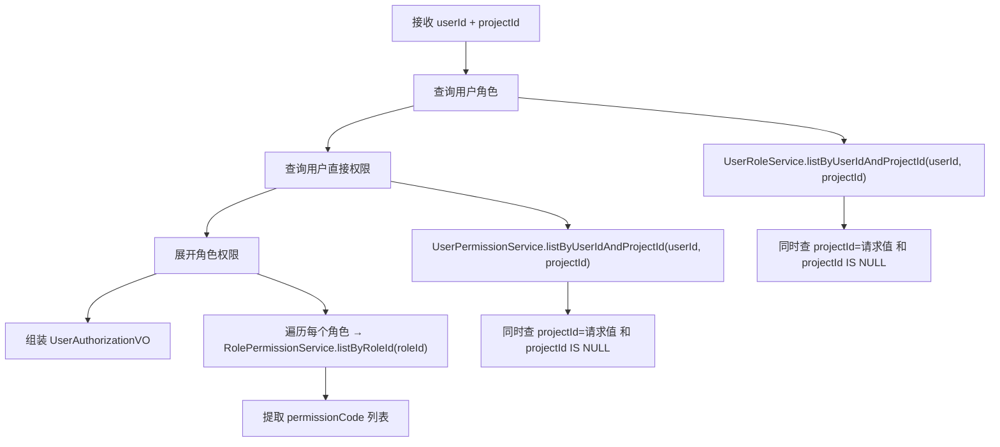

# 模块系分：用户授权

> 基于 PRD `04-用户授权模块.md`，全局设计参见 `00-全局设计与项目规格.md`

## 1. 模块概述

| 项 | 说明 |
|----|------|
| 模块名称 | 用户授权（UserAuth） |
| 功能范围 | 用户-角色分配/移除、用户直接权限授予/排除/移除、授权详情查询 |
| 涉及表 | user_role, user_permission |
| 对外依赖 | RoleService（校验角色）、PermissionService（校验权限点） |

---

## 2. 数据库设计

表结构详见 `00-全局设计与项目规格.md` 第 3.2 节 `user_role` 表和 `user_permission` 表。

### 2.1 索引说明

**user_role 表**：

| 索引名 | 类型 | 字段 | 说明 |
|--------|------|------|------|
| uk_user_role_project | 唯一 | (user_id, role_id, project_id, deleted) | 用户-角色-项目唯一 |
| idx_user_id | 普通 | user_id | 按用户查询 |
| idx_role_id | 普通 | role_id | 按角色查询（删除角色时检查引用） |
| idx_project_id | 普通 | project_id | 按项目查询 |

**user_permission 表**：

| 索引名 | 类型 | 字段 | 说明 |
|--------|------|------|------|
| uk_user_perm_effect_project | 唯一 | (user_id, permission_code, effect, project_id, deleted) | 唯一约束 |
| idx_user_id | 普通 | user_id | 按用户查询 |
| idx_permission_code | 普通 | permission_code | 按权限编码查询 |
| idx_project_id | 普通 | project_id | 按项目查询 |

### 2.2 project_id 为 NULL 的唯一索引处理

MySQL 中 NULL 值在唯一索引中不参与比较（两个 NULL 不视为重复）。为解决这个问题，有两种方案：

**方案 A（推荐）**：在应用层做唯一性校验，插入前先查询是否存在相同记录。

**方案 B**：将 project_id 的 NULL 替换为特殊值 `__GLOBAL__` 表示全局。

**本项目采用方案 A**：保持 project_id 为 NULL 表示全局的语义清晰性，在 Service 层增加唯一性校验逻辑。

---

## 3. 接口设计

### 3.1 接口列表

| 序号 | 方法 | 路径 | 说明 |
|------|------|------|------|
| 1 | POST | /users/{userId}/roles | 为用户分配角色 |
| 2 | DELETE | /users/{userId}/roles/{userRoleId} | 移除用户角色 |
| 3 | POST | /users/{userId}/permissions | 为用户直接授予/排除权限 |
| 4 | DELETE | /users/{userId}/permissions/{userPermissionId} | 移除用户直接权限 |
| 5 | GET | /users/{userId}/authorizations | 查询用户授权详情 |

### 3.2 接口详细设计

#### 3.2.1 为用户分配角色

**路径**：`POST /users/{userId}/roles`

**路径参数**：userId（String）

**请求体**：`AssignUserRoleDTO`

| 参数 | 类型 | 必填 | 校验规则 | 说明 |
|------|------|------|----------|------|
| roleId | Long | 是 | `@NotNull` | 角色 ID |
| projectId | String | 否 | `@Size(max=64)` | 项目 ID，空表示全局 |

**响应体**：`ApiResponse<UserRoleVO>`

```java
public class UserRoleVO {
    private Long id;           // user_role 主键
    private String userId;
    private Long roleId;
    private String roleCode;   // 角色编码（关联查询）
    private String roleName;   // 角色名称（关联查询）
    private String projectId;
    private String gmtCreate;
}
```

**错误响应**：

| 错误码 | 错误信息 | 触发条件 |
|--------|----------|----------|
| 142101 | 角色不存在 | roleId 无效 |
| 142103 | 角色已禁用 | 角色 DISABLED |
| 142201 | 该用户已在此项目下拥有该角色 | 唯一性冲突 |
| 142205 | 全局角色不支持指定项目 | GLOBAL 角色 + projectId 非空 |

#### 3.2.2 移除用户角色

**路径**：`DELETE /users/{userId}/roles/{userRoleId}`

**响应体**：`ApiResponse<Void>`

**错误响应**：

| 错误码 | 错误信息 | 触发条件 |
|--------|----------|----------|
| 142202 | 用户角色关系不存在 | userRoleId 无效 |

#### 3.2.3 为用户直接授予/排除权限

**路径**：`POST /users/{userId}/permissions`

**请求体**：`AssignUserPermissionDTO`

| 参数 | 类型 | 必填 | 校验规则 | 说明 |
|------|------|------|----------|------|
| permissionCode | String | 是 | `@NotBlank` | 权限编码 |
| effect | String | 是 | `@NotBlank` 枚举校验 | ALLOW/DENY |
| projectId | String | 否 | `@Size(max=64)` | 项目 ID，空表示全局 |

**响应体**：`ApiResponse<UserPermissionVO>`

```java
public class UserPermissionVO {
    private Long id;               // user_permission 主键
    private String userId;
    private String permissionCode;
    private String permissionName; // 权限名称（关联查询）
    private String effect;
    private String projectId;
    private String gmtCreate;
}
```

**错误响应**：

| 错误码 | 错误信息 | 触发条件 |
|--------|----------|----------|
| 142001 | 权限点不存在 | permissionCode 无效 |
| 142008 | 权限点已禁用 | 权限点 DISABLED |
| 142203 | 该授权记录已存在 | 唯一性冲突 |

#### 3.2.4 移除用户直接权限

**路径**：`DELETE /users/{userId}/permissions/{userPermissionId}`

**响应体**：`ApiResponse<Void>`

**错误响应**：

| 错误码 | 错误信息 | 触发条件 |
|--------|----------|----------|
| 142204 | 用户权限记录不存在 | userPermissionId 无效 |

#### 3.2.5 查询用户授权详情

**路径**：`GET /users/{userId}/authorizations`

**Query 参数**：

| 参数 | 类型 | 必填 | 说明 |
|------|------|------|------|
| projectId | String | 否 | 项目 ID，不传查全局 |

**响应体**：`ApiResponse<UserAuthorizationVO>`

```java
public class UserAuthorizationVO {
    private String userId;
    private String projectId;
    private List<UserRoleDetailVO> roles;
    private DirectPermissionVO directPermissions;
}

public class UserRoleDetailVO {
    private Long userRoleId;
    private Long roleId;
    private String roleCode;
    private String roleName;
    private String projectId;        // 该条 user_role 的 projectId
    private List<String> permissions; // 角色关联的权限编码列表
}

public class DirectPermissionVO {
    private List<UserPermissionVO> allow;
    private List<UserPermissionVO> deny;
}
```

**查询逻辑**：同时查询 `projectId = 请求值` 和 `projectId IS NULL` 的记录。

---

## 4. 代码结构设计

### 4.1 类清单

| 层 | 类名 | 包路径 | 说明 |
|----|------|--------|------|
| dal | UserRoleDO | com.permission.dal.dataobject | 用户-角色 DO |
| dal | UserPermissionDO | com.permission.dal.dataobject | 用户直接权限 DO |
| dal | UserRoleMapper | com.permission.dal.mapper | 用户-角色 Mapper |
| dal | UserPermissionMapper | com.permission.dal.mapper | 用户直接权限 Mapper |
| service | UserRoleService | com.permission.service | 用户-角色 Service 接口 |
| service | UserRoleServiceImpl | com.permission.service.impl | 用户-角色 Service 实现 |
| service | UserPermissionService | com.permission.service | 用户直接权限 Service 接口 |
| service | UserPermissionServiceImpl | com.permission.service.impl | 用户直接权限 Service 实现 |
| biz | UserAuthManager | com.permission.biz.manager | Manager 接口 |
| biz | UserAuthManagerImpl | com.permission.biz.manager.impl | Manager 实现 |
| web | UserAuthController | com.permission.web.controller | Controller |
| web | AssignUserRoleDTO | com.permission.web.dto.userauth | 分配角色 DTO |
| web | AssignUserPermissionDTO | com.permission.web.dto.userauth | 分配权限 DTO |
| web | UserRoleVO | com.permission.web.vo.userauth | 用户角色 VO |
| web | UserPermissionVO | com.permission.web.vo.userauth | 用户权限 VO |
| web | UserAuthorizationVO | com.permission.web.vo.userauth | 授权详情 VO |
| web | UserRoleDetailVO | com.permission.web.vo.userauth | 角色详情 VO |
| web | DirectPermissionVO | com.permission.web.vo.userauth | 直接权限 VO |
| web | UserAuthWebConverter | com.permission.web.converter | MapStruct 转换器 |

---

## 5. 业务逻辑设计

### 5.1 为用户分配角色

**方法**：`UserAuthManager.assignUserRole(String userId, AssignUserRoleDTO dto)`

**处理步骤**：

1. **校验角色** — `RoleService.getById(dto.roleId)`
   - 不存在 → 142101
   - DISABLED → 142103

2. **GLOBAL 角色校验**
   - 若角色 roleScope = GLOBAL 且 dto.projectId 非空 → 142205

3. **唯一性校验**
   - `UserRoleService.exists(userId, dto.roleId, dto.projectId)`
   - 已存在 → 142201

4. **创建 UserRoleDO 并保存**
   - 设置 userId、roleId、projectId
   - `UserRoleService.save()`

5. **构建 UserRoleVO 返回**
   - 关联查询角色的 code 和 name

### 5.2 移除用户角色

**方法**：`UserAuthManager.removeUserRole(String userId, Long userRoleId)`

**处理步骤**：

1. **查询记录** — `UserRoleService.getById(userRoleId)`
   - 不存在 → 142202
   - 校验 userId 匹配（安全性）

2. **逻辑删除** — `UserRoleService.removeById(userRoleId)`

### 5.3 为用户直接授予/排除权限

**方法**：`UserAuthManager.assignUserPermission(String userId, AssignUserPermissionDTO dto)`

**处理步骤**：

1. **校验权限点** — `PermissionService.getByCode(dto.permissionCode)`
   - 不存在 → 142001
   - DISABLED → 142008

2. **枚举校验** — effect 必须为 ALLOW 或 DENY

3. **唯一性校验**
   - `UserPermissionService.exists(userId, dto.permissionCode, dto.effect, dto.projectId)`
   - 已存在 → 142203

4. **创建 UserPermissionDO 并保存**

5. **构建 UserPermissionVO 返回**
   - 关联查询权限点的 name

### 5.4 移除用户直接权限

**方法**：`UserAuthManager.removeUserPermission(String userId, Long userPermissionId)`

**处理步骤**：

1. **查询记录** — `UserPermissionService.getById(userPermissionId)`
   - 不存在 → 142204
   - 校验 userId 匹配

2. **逻辑删除** — `UserPermissionService.removeById(userPermissionId)`

### 5.5 查询用户授权详情

**方法**：`UserAuthManager.getUserAuthorizations(String userId, String projectId)`

**处理步骤**：



**详细步骤**：

1. **查询用户角色列表**
   - 条件：`user_id = {userId} AND (project_id = {projectId} OR project_id IS NULL) AND deleted = 0`
   - 关联查询角色信息（code、name）
   - 过滤角色 status = ENABLED

2. **查询用户直接权限列表**
   - 条件：`user_id = {userId} AND (project_id = {projectId} OR project_id IS NULL) AND deleted = 0`
   - 关联查询权限点名称
   - 按 effect 分为 allow 和 deny 两组

3. **展开角色权限**
   - 对每个角色，查询 `role_permission` 获取权限编码列表

4. **组装返回**

---

## 6. Service 层关键方法设计

### 6.1 UserRoleService

```java
public interface UserRoleService {
    void save(UserRoleDO userRoleDO);
    UserRoleDO getById(Long id);
    void removeById(Long id);
    boolean exists(String userId, Long roleId, String projectId);
    List<UserRoleDO> listByUserIdAndProjectId(String userId, String projectId);
    long countByRoleId(Long roleId);  // 供角色删除时检查引用
}
```

### 6.2 UserPermissionService

```java
public interface UserPermissionService {
    void save(UserPermissionDO userPermissionDO);
    UserPermissionDO getById(Long id);
    void removeById(Long id);
    boolean exists(String userId, String permissionCode, String effect, String projectId);
    List<UserPermissionDO> listByUserIdAndProjectId(String userId, String projectId);
    long countByPermissionCode(String permissionCode);  // 供权限点删除时检查引用

    // 鉴权专用方法
    boolean existsDeny(String userId, String permissionCode, String projectId);
    boolean existsAllow(String userId, String permissionCode, String projectId);
}
```

**`listByUserIdAndProjectId` 实现逻辑**：
```java
LambdaQueryWrapper<UserRoleDO> wrapper = new LambdaQueryWrapper<>();
wrapper.eq(UserRoleDO::getUserId, userId)
       .and(w -> w.eq(UserRoleDO::getProjectId, projectId)
                  .or()
                  .isNull(UserRoleDO::getProjectId));
return userRoleMapper.selectList(wrapper);
```

---

## 7. 异常处理设计

本模块使用的错误码：142201-142205（用户授权相关），142001/142008（权限点相关），142101/142103（角色相关）。

---

## 8. 开发检查清单

- [ ] UserRoleDO、UserPermissionDO 包含通用字段
- [ ] project_id 为 NULL 时的唯一性在应用层校验
- [ ] 查询授权详情时同时查 projectId 和 NULL（全局）
- [ ] 分配角色时校验 GLOBAL 角色不能指定 projectId
- [ ] 移除时校验 userId 匹配（防止越权操作）
- [ ] UserPermissionService 提供鉴权专用方法（existsDeny/existsAllow）
- [ ] UserRoleService 提供 countByRoleId 供角色模块调用
- [ ] UserPermissionService 提供 countByPermissionCode 供权限点模块调用

