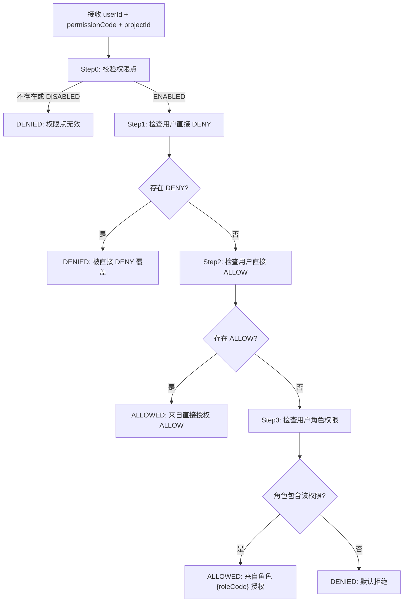

# 模块系分：统一鉴权

> 基于 PRD `05-统一鉴权模块.md`，全局设计参见 `00-全局设计与项目规格.md`

## 1. 模块概述

| 项 | 说明 |
|----|------|
| 模块名称 | 统一鉴权（Authz） |
| 功能范围 | 单权限鉴权、批量鉴权（可选）、权限来源解释 |
| 涉及表 | 不直接操作表，通过 Service 查询 |
| 对外依赖 | PermissionService、UserPermissionService、UserRoleService、RolePermissionService、RoleService |

---

## 2. 数据库设计

本模块不引入新表，纯读取操作，依赖以下 Service 的查询方法：

| Service | 方法 | 用途 |
|---------|------|------|
| PermissionService | getByCode(code) | 校验权限点存在且启用 |
| UserPermissionService | existsDeny(userId, code, projectId) | 检查用户直接 DENY |
| UserPermissionService | existsAllow(userId, code, projectId) | 检查用户直接 ALLOW |
| UserRoleService | listByUserIdAndProjectId(userId, projectId) | 获取用户角色列表 |
| RoleService | getById(roleId) | 获取角色信息（状态过滤） |
| RolePermissionService | listByRoleId(roleId) | 获取角色权限列表 |

---

## 3. 接口设计

### 3.1 接口列表

| 序号 | 方法 | 路径 | 说明 |
|------|------|------|------|
| 1 | POST | /authz/check | 单权限鉴权 |
| 2 | POST | /authz/check-batch | 批量鉴权（可选） |

### 3.2 接口详细设计

#### 3.2.1 单权限鉴权

**路径**：`POST /authz/check`

**请求体**：`AuthzCheckDTO`

| 参数 | 类型 | 必填 | 校验规则 | 说明 |
|------|------|------|----------|------|
| userId | String | 是 | `@NotBlank` | 用户 ID |
| permissionCode | String | 是 | `@NotBlank` | 权限编码 |
| projectId | String | 否 | | 项目 ID，不传表示全局鉴权 |
| explain | Boolean | 否 | | 是否返回来源说明，默认 false |

**响应体**：`ApiResponse<AuthzResultVO>`

```java
public class AuthzResultVO {
    private boolean allowed;   // 是否允许
    private String reason;     // 来源说明（explain=true 时返回）
}
```

**响应示例**：

```json
// 允许 - 角色授权
{
  "code": 200,
  "message": "success",
  "data": {
    "allowed": true,
    "reason": "来自角色 PROJECT_MANAGER 授权（项目 P1）"
  }
}

// 拒绝 - DENY 覆盖
{
  "code": 200,
  "message": "success",
  "data": {
    "allowed": false,
    "reason": "被直接 DENY 覆盖（项目 P1）"
  }
}

// 拒绝 - 默认
{
  "code": 200,
  "message": "success",
  "data": {
    "allowed": false,
    "reason": "默认拒绝：无匹配授权"
  }
}
```

**注意**：鉴权接口即使参数对应的权限点不存在，也返回 200 + allowed=false，不抛业务异常。只有参数本身为空时才返回错误。

**错误响应**：

| 错误码 | 错误信息 | 触发条件 |
|--------|----------|----------|
| 144001 | 鉴权参数无效 | userId 或 permissionCode 为空 |

#### 3.2.2 批量鉴权（可选）

**路径**：`POST /authz/check-batch`

**请求体**：`AuthzBatchCheckDTO`

| 参数 | 类型 | 必填 | 说明 |
|------|------|------|------|
| userId | String | 是 | 用户 ID |
| permissionCodes | List\<String\> | 是 | 权限编码列表 |
| projectId | String | 否 | 项目 ID |

**响应体**：`ApiResponse<AuthzBatchResultVO>`

```java
public class AuthzBatchResultVO {
    private Map<String, Boolean> results;  // permissionCode → allowed
}
```

---

## 4. 代码结构设计

### 4.1 类清单

| 层 | 类名 | 包路径 | 说明 |
|----|------|--------|------|
| biz | AuthzManager | com.permission.biz.manager | Manager 接口 |
| biz | AuthzManagerImpl | com.permission.biz.manager.impl | Manager 实现 |
| service | AuthzService | com.permission.service | 鉴权 Service 接口 |
| service | AuthzServiceImpl | com.permission.service.impl | 鉴权 Service 实现 |
| web | AuthzController | com.permission.web.controller | Controller |
| web | AuthzCheckDTO | com.permission.web.dto.authz | 单鉴权 DTO |
| web | AuthzBatchCheckDTO | com.permission.web.dto.authz | 批量鉴权 DTO |
| web | AuthzResultVO | com.permission.web.vo.authz | 鉴权结果 VO |
| web | AuthzBatchResultVO | com.permission.web.vo.authz | 批量鉴权结果 VO |

### 4.2 设计决策

**为什么鉴权有独立的 AuthzService？**

鉴权逻辑涉及多表查询和复杂判断，将核心鉴权算法封装在 AuthzService 中：
- AuthzService 负责单次鉴权的核心算法
- AuthzManager 负责参数校验和批量编排

---

## 5. 业务逻辑设计

### 5.1 核心鉴权算法

**方法**：`AuthzService.check(String userId, String permissionCode, String projectId)`

**返回**：`AuthzResult`（内部对象，包含 allowed + reason）



**详细实现步骤**：

#### Step 0：校验权限点

```java
PermissionDO permission = permissionService.getByCode(permissionCode);
if (permission == null || CommonStatusEnum.DISABLED.name().equals(permission.getStatus())) {
    return AuthzResult.denied("权限点无效或已禁用");
}
```

#### Step 1：检查用户直接 DENY

```java
// 同时检查项目级和全局 DENY
boolean hasDeny = userPermissionService.existsDeny(userId, permissionCode, projectId);
if (hasDeny) {
    return AuthzResult.denied("被直接 DENY 覆盖");
}
```

**`existsDeny` 实现逻辑**：
```sql
SELECT COUNT(*) FROM user_permission
WHERE user_id = #{userId}
  AND permission_code = #{permissionCode}
  AND effect = 'DENY'
  AND (project_id = #{projectId} OR project_id IS NULL)
  AND deleted = 0
```

#### Step 2：检查用户直接 ALLOW

```java
boolean hasAllow = userPermissionService.existsAllow(userId, permissionCode, projectId);
if (hasAllow) {
    return AuthzResult.allowed("来自直接授权 ALLOW");
}
```

**`existsAllow` 实现逻辑**：同上，effect = 'ALLOW'。

#### Step 3：检查用户角色权限

```java
// 1. 获取用户在该项目 + 全局的所有角色
List<UserRoleDO> userRoles = userRoleService.listByUserIdAndProjectId(userId, projectId);

// 2. 遍历每个角色
for (UserRoleDO userRole : userRoles) {
    // 2.1 检查角色是否启用
    RoleDO role = roleService.getById(userRole.getRoleId());
    if (role == null || CommonStatusEnum.DISABLED.name().equals(role.getStatus())) {
        continue;  // 跳过禁用角色
    }

    // 2.2 检查角色是否包含该权限
    boolean hasPermission = rolePermissionService.exists(role.getId(), permissionCode);
    if (hasPermission) {
        String projectInfo = userRole.getProjectId() != null
            ? "（项目 " + userRole.getProjectId() + "）"
            : "（全局）";
        return AuthzResult.allowed("来自角色 " + role.getCode() + " 授权" + projectInfo);
    }
}

// 3. 默认拒绝
return AuthzResult.denied("默认拒绝：无匹配授权");
```

### 5.2 来源说明（reason）格式

| 场景 | reason 格式 |
|------|-------------|
| 直接 DENY（项目级） | "被直接 DENY 覆盖（项目 P1）" |
| 直接 DENY（全局） | "被直接 DENY 覆盖（全局）" |
| 直接 ALLOW（项目级） | "来自直接授权 ALLOW（项目 P1）" |
| 直接 ALLOW（全局） | "来自直接授权 ALLOW（全局）" |
| 角色授权（项目级） | "来自角色 PROJECT_MANAGER 授权（项目 P1）" |
| 角色授权（全局） | "来自角色 BASE_USER 授权（全局）" |
| 权限点无效 | "权限点无效或已禁用" |
| 默认拒绝 | "默认拒绝：无匹配授权" |

为了生成精确的 reason，需要在 Step 1 和 Step 2 中查询具体的匹配记录（而非仅 exists）以获取 projectId 信息：

```java
// 改进：查询具体的 DENY 记录以获取 projectId
UserPermissionDO denyRecord = userPermissionService.findDeny(userId, permissionCode, projectId);
if (denyRecord != null) {
    String projectInfo = denyRecord.getProjectId() != null
        ? "（项目 " + denyRecord.getProjectId() + "）"
        : "（全局）";
    return AuthzResult.denied("被直接 DENY 覆盖" + projectInfo);
}
```

### 5.3 批量鉴权

**方法**：`AuthzManager.checkBatch(AuthzBatchCheckDTO dto)`

**处理步骤**：

1. 参数校验
2. 遍历 permissionCodes，对每个调用 `AuthzService.check()`
3. 汇总结果为 Map<String, Boolean>

**优化点**（后续可做）：
- 批量查询用户角色（一次查询复用）
- 批量查询角色权限（减少 DB 查询次数）

### 5.4 AuthzManager 层

**方法**：`AuthzManager.check(AuthzCheckDTO dto)`

**处理步骤**：

1. **参数校验** — userId 和 permissionCode 非空，否则 144001
2. **调用核心鉴权** — `AuthzService.check(dto.userId, dto.permissionCode, dto.projectId)`
3. **构建 AuthzResultVO** — 设置 allowed 和 reason（explain=true 时才设置 reason）

---

## 6. 内部数据对象

```java
/**
 * 鉴权内部结果对象（Service 层使用，不对外暴露）
 */
public class AuthzResult {
    private boolean allowed;
    private String reason;

    public static AuthzResult allowed(String reason) { ... }
    public static AuthzResult denied(String reason) { ... }
}
```

放置位置：`com.permission.service.model.AuthzResult`（service 模块内部）

---

## 7. Service 层依赖的关键方法

### 7.1 需要新增的 Service 方法

| Service | 方法 | 说明 |
|---------|------|------|
| UserPermissionService | `findDeny(userId, permissionCode, projectId)` | 查找 DENY 记录（含全局） |
| UserPermissionService | `findAllow(userId, permissionCode, projectId)` | 查找 ALLOW 记录（含全局） |
| RolePermissionService | `exists(roleId, permissionCode)` | 判断角色是否包含某权限 |

### 7.2 findDeny / findAllow 实现

```java
public UserPermissionDO findDeny(String userId, String permissionCode, String projectId) {
    LambdaQueryWrapper<UserPermissionDO> wrapper = new LambdaQueryWrapper<>();
    wrapper.eq(UserPermissionDO::getUserId, userId)
           .eq(UserPermissionDO::getPermissionCode, permissionCode)
           .eq(UserPermissionDO::getEffect, PermissionEffectEnum.DENY.name())
           .and(w -> w.eq(UserPermissionDO::getProjectId, projectId)
                      .or()
                      .isNull(UserPermissionDO::getProjectId))
           .last("LIMIT 1");
    return userPermissionMapper.selectOne(wrapper);
}
```

### 7.3 RolePermissionService.exists 实现

```java
public boolean exists(Long roleId, String permissionCode) {
    LambdaQueryWrapper<RolePermissionDO> wrapper = new LambdaQueryWrapper<>();
    wrapper.eq(RolePermissionDO::getRoleId, roleId)
           .eq(RolePermissionDO::getPermissionCode, permissionCode);
    return rolePermissionMapper.selectCount(wrapper) > 0;
}
```

---

## 8. 性能考虑

### 8.1 当前 MVP 方案

每次鉴权执行多次 DB 查询：
1. 查权限点状态（1 次）
2. 查 DENY 记录（1 次）
3. 查 ALLOW 记录（1 次）
4. 查用户角色列表（1 次）
5. 遍历角色查角色权限（N 次，N = 角色数量）

**MVP 阶段可接受**，总查询次数 = 4 + N（N 通常 ≤ 5）。

### 8.2 后续优化方向

- **Redis 缓存**：缓存角色-权限映射、用户-角色映射
- **批量查询**：一次查出所有角色的权限，减少 N 次查询为 1 次
- **本地缓存**：Caffeine 缓存权限点状态

---

## 9. 异常处理设计

本模块仅使用 144001（鉴权参数无效）。

鉴权结果本身不抛异常，通过 `allowed = false` + `reason` 表达拒绝原因。

---

## 10. 开发检查清单

- [ ] 鉴权接口返回 200 + allowed=false，而非抛异常
- [ ] DENY 优先级最高，覆盖 ALLOW 和角色权限
- [ ] 同时检查 projectId 和 NULL（全局）两类数据
- [ ] 角色 DISABLED 时跳过该角色的权限检查
- [ ] 权限点 DISABLED 时直接返回 DENIED
- [ ] explain=false 时 reason 返回 null（减少数据量）
- [ ] AuthzResult 是 Service 层内部对象，不对外暴露
- [ ] 批量鉴权复用单次鉴权逻辑

