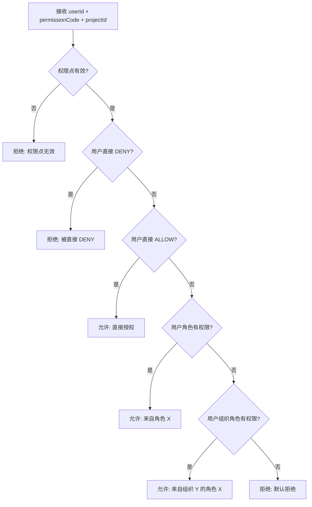

```
# 模块系分：组织权限

> 基于 PRD `06-组织权限模块.md`，全局设计参见 `00-全局设计与项目规格.md`

## 1. 模块概述

| 项 | 说明 |
|----|------|
| 模块名称 | 组织权限（Organization） |
| 功能范围 | 组织树 CRUD、组织-角色分配/移除、用户-组织关联/移除、鉴权链路扩展 |
| 涉及表 | organization, org_role, user_org |
| 对外依赖 | RoleService（校验角色）、AuthzService（鉴权链路扩展） |

---

## 2. 数据库设计

### 2.1 organization 表（组织表）

```sql
CREATE TABLE IF NOT EXISTS `organization` (
    `id`            BIGINT UNSIGNED NOT NULL AUTO_INCREMENT COMMENT '主键ID',
    `code`          VARCHAR(64)     NOT NULL COMMENT '组织编码，全局唯一',
    `name`          VARCHAR(128)    NOT NULL COMMENT '组织名称',
    `parent_id`     BIGINT UNSIGNED DEFAULT NULL COMMENT '父组织ID，NULL表示顶级',
    `sort_order`    INT             DEFAULT 0 COMMENT '同级排序号',
    `status`        VARCHAR(16)     NOT NULL DEFAULT 'ENABLED' COMMENT '状态：ENABLED/DISABLED',
    `description`   VARCHAR(256)    DEFAULT NULL COMMENT '描述',
    `gmt_create`    DATETIME        NOT NULL DEFAULT CURRENT_TIMESTAMP COMMENT '创建时间',
    `gmt_modified`  DATETIME        NOT NULL DEFAULT CURRENT_TIMESTAMP ON UPDATE CURRENT_TIMESTAMP COMMENT '修改时间',
    `deleted`       TINYINT(1)      NOT NULL DEFAULT 0 COMMENT '逻辑删除：0=未删除，1=已删除',
    PRIMARY KEY (`id`),
    UNIQUE KEY `uk_code` (`code`, `deleted`),
    KEY `idx_parent_id` (`parent_id`),
    KEY `idx_status` (`status`)
) ENGINE=InnoDB DEFAULT CHARSET=utf8mb4 COMMENT='组织表';
```

### 2.2 org_role 表（组织-角色关联表）

```sql
CREATE TABLE IF NOT EXISTS `org_role` (
    `id`            BIGINT UNSIGNED NOT NULL AUTO_INCREMENT COMMENT '主键ID',
    `org_id`        BIGINT UNSIGNED NOT NULL COMMENT '组织ID',
    `role_id`       BIGINT UNSIGNED NOT NULL COMMENT '角色ID',
    `gmt_create`    DATETIME        NOT NULL DEFAULT CURRENT_TIMESTAMP COMMENT '创建时间',
    `gmt_modified`  DATETIME        NOT NULL DEFAULT CURRENT_TIMESTAMP ON UPDATE CURRENT_TIMESTAMP COMMENT '修改时间',
    `deleted`       TINYINT(1)      NOT NULL DEFAULT 0 COMMENT '逻辑删除：0=未删除，1=已删除',
    PRIMARY KEY (`id`),
    UNIQUE KEY `uk_org_role` (`org_id`, `role_id`, `deleted`),
    KEY `idx_org_id` (`org_id`),
    KEY `idx_role_id` (`role_id`)
) ENGINE=InnoDB DEFAULT CHARSET=utf8mb4 COMMENT='组织-角色关联表';
```

### 2.3 user_org 表（用户-组织关联表）

```sql
CREATE TABLE IF NOT EXISTS `user_org` (
    `id`            BIGINT UNSIGNED NOT NULL AUTO_INCREMENT COMMENT '主键ID',
    `user_id`       VARCHAR(64)     NOT NULL COMMENT '用户ID',
    `org_id`        BIGINT UNSIGNED NOT NULL COMMENT '组织ID',
    `gmt_create`    DATETIME        NOT NULL DEFAULT CURRENT_TIMESTAMP COMMENT '创建时间',
    `gmt_modified`  DATETIME        NOT NULL DEFAULT CURRENT_TIMESTAMP ON UPDATE CURRENT_TIMESTAMP COMMENT '修改时间',
    `deleted`       TINYINT(1)      NOT NULL DEFAULT 0 COMMENT '逻辑删除：0=未删除，1=已删除',
    PRIMARY KEY (`id`),
    UNIQUE KEY `uk_user_org` (`user_id`, `org_id`, `deleted`),
    KEY `idx_user_id` (`user_id`),
    KEY `idx_org_id` (`org_id`)
) ENGINE=InnoDB DEFAULT CHARSET=utf8mb4 COMMENT='用户-组织关联表';
```

### 2.4 索引说明

**organization 表**：

| 索引名 | 类型 | 字段 | 说明 |
|--------|------|------|------|
| uk_code | 唯一 | (code, deleted) | 编码唯一 |
| idx_parent_id | 普通 | parent_id | 按父组织查询子组织 |
| idx_status | 普通 | status | 按状态筛选 |

**org_role 表**：

| 索引名 | 类型 | 字段 | 说明 |
|--------|------|------|------|
| uk_org_role | 唯一 | (org_id, role_id, deleted) | 组织-角色唯一 |
| idx_org_id | 普通 | org_id | 按组织查询角色 |
| idx_role_id | 普通 | role_id | 按角色查询组织（删除角色时检查引用） |

**user_org 表**：

| 索引名 | 类型 | 字段 | 说明 |
|--------|------|------|------|
| uk_user_org | 唯一 | (user_id, org_id, deleted) | 用户-组织唯一 |
| idx_user_id | 普通 | user_id | 按用户查询组织 |
| idx_org_id | 普通 | org_id | 按组织查询成员 |

---

## 3. 接口设计

### 3.1 接口列表

| 序号 | 方法 | 路径 | 说明 |
|------|------|------|------|
| 1 | POST | /organizations | 创建组织 |
| 2 | PUT | /organizations/{id} | 编辑组织 |
| 3 | DELETE | /organizations/{id} | 删除组织 |
| 4 | GET | /organizations/{id} | 查询组织详情 |
| 5 | GET | /organizations/tree | 查询组织树 |
| 6 | POST | /organizations/{orgId}/roles | 为组织分配角色 |
| 7 | DELETE | /organizations/{orgId}/roles/{roleId} | 移除组织角色 |
| 8 | GET | /organizations/{orgId}/roles | 查询组织角色列表 |
| 9 | POST | /organizations/{orgId}/members | 将用户加入组织 |
| 10 | DELETE | /organizations/{orgId}/members/{userId} | 将用户移出组织 |
| 11 | GET | /organizations/{orgId}/members | 查询组织成员列表 |

### 3.2 接口详细设计

#### 3.2.1 创建组织

**路径**：`POST /organizations`

**请求体**：`CreateOrganizationDTO`

| 参数 | 类型 | 必填 | 校验规则 | 说明 |
|------|------|------|----------|------|
| code | String | 是 | `@NotBlank` `@Pattern(^[A-Z][A-Z0-9_]{1,63}$)` | 组织编码 |
| name | String | 是 | `@NotBlank` `@Size(max=128)` | 组织名称 |
| parentId | Long | 否 | | 父组织ID |
| sortOrder | Integer | 否 | `@Min(0)` | 排序号 |
| description | String | 否 | `@Size(max=256)` | 描述 |

**响应体**：`ApiResponse<OrganizationVO>`

**错误响应**：

| 错误码 | 错误信息 | 触发条件 |
|--------|----------|----------|
| 142301 | 组织编码已存在 | code 重复 |
| 142302 | 父组织不存在 | parentId 无效 |

#### 3.2.2 编辑组织

**路径**：`PUT /organizations/{id}`

**请求体**：`UpdateOrganizationDTO`

| 参数 | 类型 | 必填 | 说明 |
|------|------|------|------|
| name | String | 否 | 组织名称 |
| parentId | Long | 否 | 父组织ID |
| sortOrder | Integer | 否 | 排序号 |
| status | String | 否 | 状态 |
| description | String | 否 | 描述 |

**错误响应**：

| 错误码 | 错误信息 | 触发条件 |
|--------|----------|----------|
| 142303 | 组织不存在 | id 无效 |
| 142302 | 父组织不存在 | parentId 无效 |
| 142304 | 不能将自身或子组织设为父组织 | 循环引用 |

#### 3.2.3 删除组织

**路径**：`DELETE /organizations/{id}`

**错误响应**：

| 错误码 | 错误信息 | 触发条件 |
|--------|----------|----------|
| 142303 | 组织不存在 | id 无效 |
| 142305 | 该组织下存在子组织，请先删除子组织 | 有子组织 |
| 142306 | 该组织已关联角色，请先解除关联 | 有关联角色 |
| 142307 | 该组织下存在成员，请先移除成员 | 有关联用户 |

#### 3.2.4 为组织分配角色

**路径**：`POST /organizations/{orgId}/roles`

**请求体**：`AssignOrgRolesDTO`

| 参数 | 类型 | 必填 | 说明 |
|------|------|------|------|
| roleIds | List<Long> | 是 | 角色ID列表 |

**错误响应**：

| 错误码 | 错误信息 | 触发条件 |
|--------|----------|----------|
| 142303 | 组织不存在 | orgId 无效 |
| 142101 | 角色不存在 | roleId 无效 |
| 142103 | 角色已禁用 | 角色 DISABLED |

#### 3.2.5 将用户加入组织

**路径**：`POST /organizations/{orgId}/members`

**请求体**：`AssignOrgMembersDTO`

| 参数 | 类型 | 必填 | 说明 |
|------|------|------|------|
| userIds | List<String> | 是 | 用户ID列表 |

**错误响应**：

| 错误码 | 错误信息 | 触发条件 |
|--------|----------|----------|
| 142303 | 组织不存在 | orgId 无效 |

---

## 4. 代码结构设计

### 4.1 类清单

| 层 | 类名 | 包路径 | 说明 |
|----|------|--------|------|
| dal | OrganizationDO | com.permission.dal.dataobject | 组织 DO |
| dal | OrgRoleDO | com.permission.dal.dataobject | 组织-角色 DO |
| dal | UserOrgDO | com.permission.dal.dataobject | 用户-组织 DO |
| dal | OrganizationMapper | com.permission.dal.mapper | 组织 Mapper |
| dal | OrgRoleMapper | com.permission.dal.mapper | 组织-角色 Mapper |
| dal | UserOrgMapper | com.permission.dal.mapper | 用户-组织 Mapper |
| service | OrganizationService | com.permission.service | 组织 Service 接口 |
| service | OrganizationServiceImpl | com.permission.service.impl | 组织 Service 实现 |
| service | OrgRoleService | com.permission.service | 组织-角色 Service 接口 |
| service | OrgRoleServiceImpl | com.permission.service.impl | 组织-角色 Service 实现 |
| service | UserOrgService | com.permission.service | 用户-组织 Service 接口 |
| service | UserOrgServiceImpl | com.permission.service.impl | 用户-组织 Service 实现 |
| biz | OrganizationManager | com.permission.biz.manager | Manager 接口 |
| biz | OrganizationManagerImpl | com.permission.biz.manager.impl | Manager 实现 |
| web | OrganizationController | com.permission.web.controller | Controller |
| biz | CreateOrganizationDTO | com.permission.biz.dto.organization | 创建组织 DTO |
| biz | UpdateOrganizationDTO | com.permission.biz.dto.organization | 编辑组织 DTO |
| biz | AssignOrgRolesDTO | com.permission.biz.dto.organization | 分配角色 DTO |
| biz | AssignOrgMembersDTO | com.permission.biz.dto.organization | 分配成员 DTO |
| biz | OrganizationVO | com.permission.biz.vo.organization | 组织 VO |
| biz | OrganizationTreeVO | com.permission.biz.vo.organization | 组织树 VO |
| biz | OrgRoleVO | com.permission.biz.vo.organization | 组织角色 VO |
| biz | OrgMemberVO | com.permission.biz.vo.organization | 组织成员 VO |

---

## 5. 业务逻辑设计

### 5.1 创建组织

**方法**：`OrganizationManager.createOrganization(CreateOrganizationDTO dto)`

**处理步骤**：

1. **编码唯一性校验** — `OrganizationService.getByCode(dto.code)`
   - 已存在 → 142301
2. **父组织校验**（若 parentId 非空）
   - `OrganizationService.getById(dto.parentId)` 不存在 → 142302
3. **创建 OrganizationDO 并保存**
4. **返回 OrganizationVO**

### 5.2 删除组织

**方法**：`OrganizationManager.deleteOrganization(Long id)`

**处理步骤**：

1. **查询组织** — 不存在 → 142303
2. **检查子组织** — `OrganizationService.countByParentId(id)` > 0 → 142305
3. **检查关联角色** — `OrgRoleService.countByOrgId(id)` > 0 → 142306
4. **检查关联成员** — `UserOrgService.countByOrgId(id)` > 0 → 142307
5. **逻辑删除**

### 5.3 为组织分配角色

**方法**：`OrganizationManager.assignRoles(Long orgId, AssignOrgRolesDTO dto)`

**处理步骤**：

1. **校验组织** — 不存在 → 142303
2. **遍历 roleIds，逐个校验角色** — 不存在 → 142101，禁用 → 142103
3. **幂等插入** — 已存在的跳过，不存在的创建
4. **清除相关用户的鉴权缓存**

### 5.4 将用户加入组织

**方法**：`OrganizationManager.addMembers(Long orgId, AssignOrgMembersDTO dto)`

**处理步骤**：

1. **校验组织** — 不存在 → 142303
2. **遍历 userIds，幂等插入**
3. **清除相关用户的鉴权缓存**

### 5.5 鉴权链路扩展

**原有鉴权流程**（AuthzServiceImpl.check）需要扩展第 4 步：



**组织角色查询逻辑**：
1. `UserOrgService.listByUserId(userId)` → 获取用户所属组织列表
2. 对每个组织，向上遍历组织树收集所有祖先组织
3. `OrgRoleService.listByOrgIds(orgIds)` → 获取所有组织的角色
4. 检查这些角色是否包含目标权限

---

## 6. 错误码设计

| 枚举名 | 错误码 | 错误信息 | 说明 |
|--------|--------|----------|------|
| ORG_CODE_EXISTS | 142301 | 组织编码已存在：%s | code 唯一性冲突 |
| ORG_PARENT_NOT_FOUND | 142302 | 父组织不存在 | parentId 无效 |
| ORG_NOT_FOUND | 142303 | 组织不存在 | id 查询不到 |
| ORG_CIRCULAR_REF | 142304 | 不能将自身或子组织设为父组织 | 循环引用 |
| ORG_HAS_CHILDREN | 142305 | 该组织下存在子组织，请先删除子组织 | 删除前置检查 |
| ORG_HAS_ROLES | 142306 | 该组织已关联角色，请先解除关联 | 删除前置检查 |
| ORG_HAS_MEMBERS | 142307 | 该组织下存在成员，请先移除成员 | 删除前置检查 |

---

## 7. 开发检查清单

- [ ] OrganizationDO、OrgRoleDO、UserOrgDO 包含通用字段
- [ ] 组织树构建使用递归 + parentId
- [ ] 删除组织前检查子组织、关联角色、关联成员
- [ ] 分配角色/成员幂等处理
- [ ] 鉴权链路扩展：在角色权限检查后增加组织角色检查
- [ ] 鉴权结果 reason 包含组织来源信息
- [ ] 组织角色变更时清除相关用户缓存
- [ ] 用户加入/移出组织时清除该用户缓存
```

