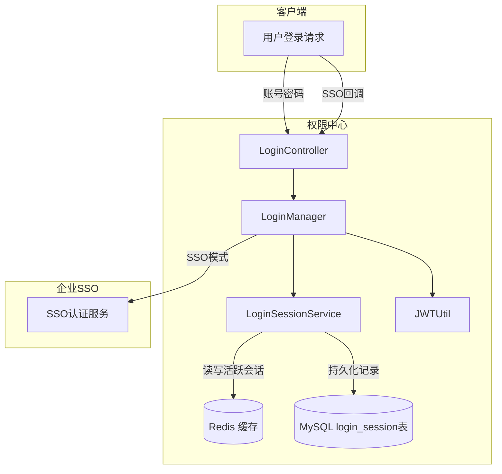
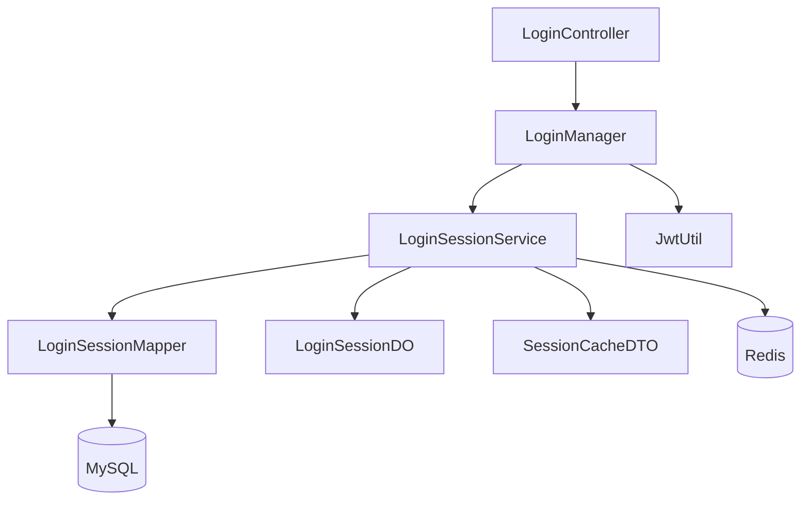
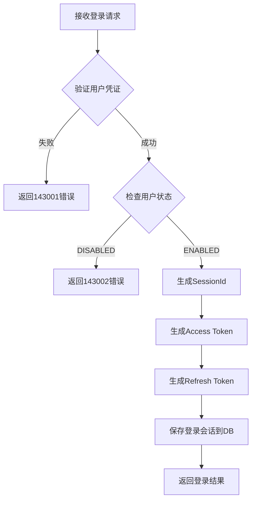
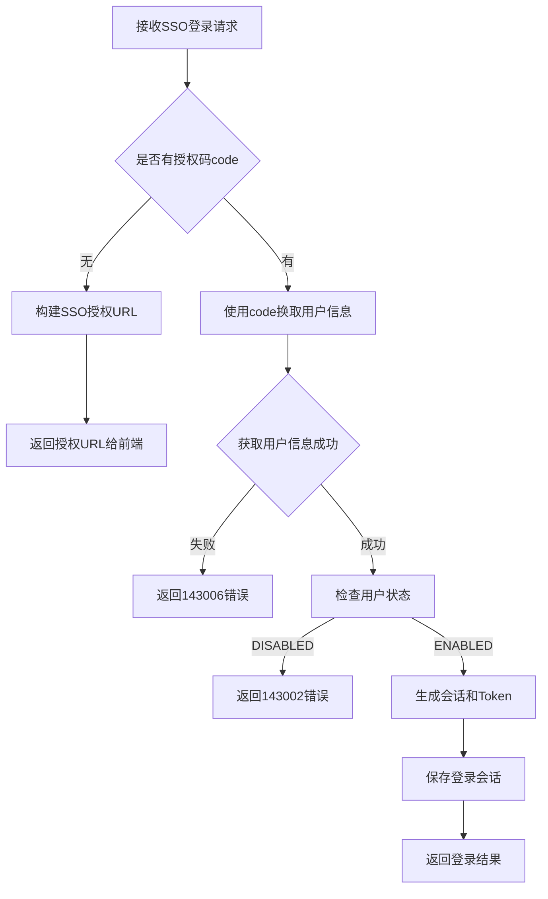
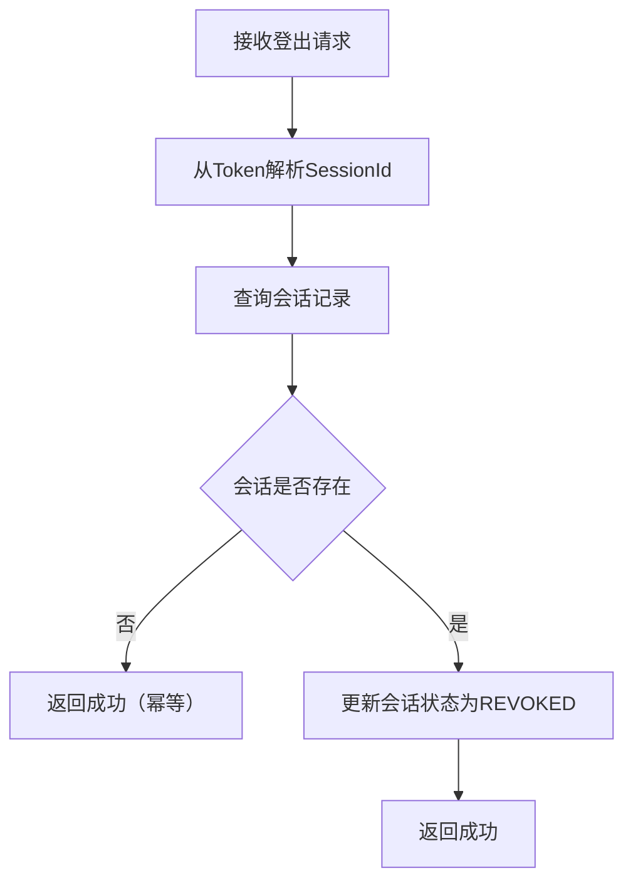
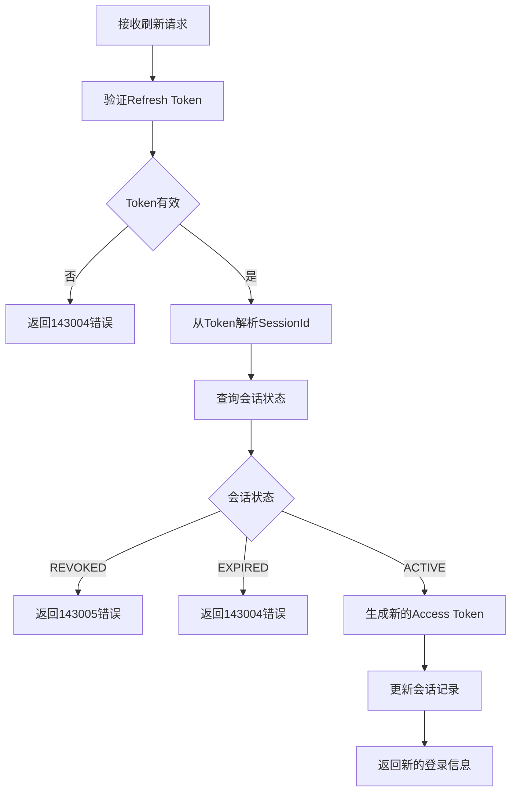

# 模块系分：登录认证

> 基于 PRD 权限管理系统总览，全局设计参见 `00-全局设计与项目规格.md`

## 1. 模块概述

| 项 | 说明 |
|----|------|
| 模块名称 | 登录认证（Auth） |
| 功能范围 | 用户登录、登出、Token刷新、SSO对接、会话管理 |
| 涉及表 | login_session |
| 中间件 | Redis（会话缓存） |
| 对外依赖 | 无 |

---

## 2. 设计方案选型

### 2.1 登录方式

本项目支持两种登录方式：

| 方式 | 场景 | 说明 |
|------|------|------|
| 账号密码登录 | 本地开发/测试环境 | 简单用户名密码验证 |
| SSO单点登录 | 生产环境 | 对接企业统一身份认证 |

### 2.2 认证方案

采用 **JWT Token + 会话管理** 混合方案：

- **Access Token**：短期有效（2小时），用于接口认证
- **Refresh Token**：长期有效（7天），用于刷新 Access Token
- **会话管理**：服务端保存登录会话，支持主动登出

### 2.3 会话存储方案

采用 **Redis 缓存 + MySQL 持久化** 双写方案：

| 存储介质 | 用途 | 特点 |
|----------|------|------|
| **Redis** | 活跃会话缓存 | 高性能读写，支持 TTL 自动过期 |
| **MySQL** | 会话记录持久化 | 审计日志，支持历史查询 |

**Redis Key 设计**：

```
session:{sessionId}          -> SessionCacheDTO (JSON)
session:user:{userId}        -> Set<sessionId>  (用户的所有活跃会话)
```

**为什么选择 Redis 方案？**

1. **性能优势**：登录验证每次请求都要验证会话，Redis 内存读写比数据库快 10-100 倍
2. **天然过期**：Redis TTL 自动清理过期会话，无需定时任务
3. **分布式支持**：多实例部署时共享会话状态
4. **原子操作**：支持原子性的会话撤销和状态更新
5. **减轻数据库压力**：高频查询不走数据库

### 2.4 架构图



---

## 3. 数据库设计

### 3.1 登录会话表 (login_session)

```sql
-- 登录会话表
CREATE TABLE IF NOT EXISTS `login_session` (
    `id`                BIGINT UNSIGNED NOT NULL AUTO_INCREMENT COMMENT '主键ID',
    `session_id`        VARCHAR(64)     NOT NULL COMMENT '会话ID（UUID）',
    `user_id`           VARCHAR(64)     NOT NULL COMMENT '用户ID',
    `user_name`         VARCHAR(128)    NOT NULL COMMENT '用户名',
    `login_type`        VARCHAR(16)     NOT NULL COMMENT '登录类型：PASSWORD/SSO',
    `access_token`      VARCHAR(512)    NOT NULL COMMENT 'Access Token',
    `refresh_token`     VARCHAR(512)    NOT NULL COMMENT 'Refresh Token',
    `expires_at`        DATETIME        NOT NULL COMMENT 'Access Token 过期时间',
    `refresh_expires_at` DATETIME       NOT NULL COMMENT 'Refresh Token 过期时间',
    `login_ip`          VARCHAR(64)     DEFAULT NULL COMMENT '登录IP',
    `user_agent`        VARCHAR(512)    DEFAULT NULL COMMENT '浏览器UA',
    `status`            VARCHAR(16)     NOT NULL DEFAULT 'ACTIVE' COMMENT '状态：ACTIVE/EXPIRED/REVOKED',
    `gmt_create`        DATETIME        NOT NULL DEFAULT CURRENT_TIMESTAMP COMMENT '创建时间',
    `gmt_modified`      DATETIME        NOT NULL DEFAULT CURRENT_TIMESTAMP ON UPDATE CURRENT_TIMESTAMP COMMENT '修改时间',
    `deleted`           TINYINT(1)      NOT NULL DEFAULT 0 COMMENT '逻辑删除：0=未删除，1=已删除',
    PRIMARY KEY (`id`),
    UNIQUE KEY `uk_session_id` (`session_id`, `deleted`),
    KEY `idx_user_id` (`user_id`),
    KEY `idx_access_token` (`access_token`(100)),
    KEY `idx_refresh_token` (`refresh_token`(100)),
    KEY `idx_status` (`status`),
    KEY `idx_expires_at` (`expires_at`)
) ENGINE=InnoDB DEFAULT CHARSET=utf8mb4 COMMENT='登录会话表';
```

### 3.2 用户表扩展 (可选)

如果需要存储用户密码，可以增加 `user` 表：

```sql
-- 用户表（简化版，用于本地账号密码登录）
CREATE TABLE IF NOT EXISTS `user` (
    `id`                BIGINT UNSIGNED NOT NULL AUTO_INCREMENT COMMENT '主键ID',
    `user_id`           VARCHAR(64)     NOT NULL COMMENT '用户ID',
    `user_name`         VARCHAR(128)    NOT NULL COMMENT '用户名',
    `password`          VARCHAR(256)    NOT NULL COMMENT '密码（BCrypt加密）',
    `salt`              VARCHAR(64)     DEFAULT NULL COMMENT '盐值',
    `status`            VARCHAR(16)     NOT NULL DEFAULT 'ENABLED' COMMENT '状态：ENABLED/DISABLED',
    `gmt_create`        DATETIME        NOT NULL DEFAULT CURRENT_TIMESTAMP COMMENT '创建时间',
    `gmt_modified`      DATETIME        NOT NULL DEFAULT CURRENT_TIMESTAMP ON UPDATE CURRENT_TIMESTAMP COMMENT '修改时间',
    `deleted`           TINYINT(1)      NOT NULL DEFAULT 0 COMMENT '逻辑删除：0=未删除，1=已删除',
    PRIMARY KEY (`id`),
    UNIQUE KEY `uk_user_id` (`user_id`, `deleted`),
    UNIQUE KEY `uk_user_name` (`user_name`, `deleted`)
) ENGINE=InnoDB DEFAULT CHARSET=utf8mb4 COMMENT='用户表';
```

**说明**：由于权限中心已有 `user_role` 和 `user_permission` 表使用 `user_id` 作为外键，为简化设计，本项目采用 **无用户表方案**：
- SSO 模式：用户信息从 SSO 获取
- 账号密码模式：用户信息在配置文件或内存中管理（适合开发测试）

---

## 4. 接口设计

### 4.1 接口列表

| 序号 | 方法 | 路径 | 说明 |
|------|------|------|------|
| 1 | POST | /auth/login | 账号密码登录 |
| 2 | POST | /auth/sso-login | SSO登录（获取授权URL/回调处理） |
| 3 | POST | /auth/logout | 登出 |
| 4 | POST | /auth/refresh | 刷新Token |
| 5 | GET | /auth/current-user | 获取当前登录用户信息 |

### 4.2 接口详细设计

#### 4.2.1 账号密码登录

**路径**：`POST /auth/login`

**请求体**：`LoginDTO`

| 参数 | 类型 | 必填 | 校验规则 | 说明 |
|------|------|------|----------|------|
| userName | String | 是 | `@NotBlank` | 用户名 |
| password | String | 是 | `@NotBlank` | 密码 |

**响应体**：`ApiResponse<LoginVO>`

```java
public class LoginVO {
    private String sessionId;        // 会话ID
    private String accessToken;      // Access Token
    private String refreshToken;     // Refresh Token
    private Long expiresAt;          // Access Token 过期时间戳（秒）
    private Long refreshExpiresAt;   // Refresh Token 过期时间戳（秒）
    private UserInfoVO userInfo;     // 用户信息
}

public class UserInfoVO {
    private String userId;
    private String userName;
    // 其他用户信息扩展
}
```

**错误响应**：

| 错误码 | 错误信息 | 触发条件 |
|--------|----------|----------|
| 143001 | 用户名或密码错误 | 凭证无效 |
| 143002 | 用户已禁用 | 用户状态为 DISABLED |
| 143003 | 登录失败，请稍后重试 | 系统异常 |

#### 4.2.2 SSO登录

**路径**：`POST /auth/sso-login`

**请求体**：`SsoLoginDTO`

| 参数 | 类型 | 必填 | 校验规则 | 说明 |
|------|------|------|----------|------|
| code | String | 否 | - | SSO授权码（回调时传入） |
| redirectUri | String | 是 | `@NotBlank` | 回调地址 |

**响应体**：

- 首次调用（无code）：返回 SSO 授权 URL
```json
{
  "code": 200,
  "data": {
    "authUrl": "https://sso.example.com/oauth/authorize?..."
  }
}
```

- 回调调用（有code）：返回登录结果
```json
{
  "code": 200,
  "data": {
    "sessionId": "xxx",
    "accessToken": "xxx",
    "refreshToken": "xxx",
    ...
  }
}
```

#### 4.2.3 登出

**路径**：`POST /auth/logout`

**请求头**：`Authorization: Bearer {accessToken}`

**响应体**：`ApiResponse<Void>`

#### 4.2.4 刷新Token

**路径**：`POST /auth/refresh`

**请求体**：`RefreshTokenDTO`

| 参数 | 类型 | 必填 | 校验规则 | 说明 |
|------|------|------|----------|------|
| refreshToken | String | 是 | `@NotBlank` | Refresh Token |

**响应体**：`ApiResponse<LoginVO>`

**错误响应**：

| 错误码 | 错误信息 | 触发条件 |
|--------|----------|----------|
| 143004 | Refresh Token无效 | Token不存在或已过期 |
| 143005 | 会话已失效 | 会话状态为 REVOKED |

#### 4.2.5 获取当前登录用户信息

**路径**：`GET /auth/current-user`

**请求头**：`Authorization: Bearer {accessToken}`

**响应体**：`ApiResponse<UserInfoVO>`

---

## 5. 代码结构设计

### 5.1 类清单

| 层 | 类名 | 包路径 | 说明 |
|----|------|--------|------|
| dal | LoginSessionDO | com.permission.dal.dataobject | 登录会话 DO |
| dal | LoginSessionMapper | com.permission.dal.mapper | 登录会话 Mapper |
| service | LoginSessionService | com.permission.service | 会话 Service 接口 |
| service | LoginSessionServiceImpl | com.permission.service.impl | 会话 Service 实现（Redis + MySQL） |
| service | SessionCacheDTO | com.permission.service.dto | 会话缓存 DTO（Redis 存储） |
| biz | LoginManager | com.permission.biz.manager | 登录 Manager 接口 |
| biz | LoginManagerImpl | com.permission.biz.manager.impl | 登录 Manager 实现 |
| web | LoginController | com.permission.web.controller | 登录 Controller |
| web | LoginDTO | com.permission.biz.dto.auth | 登录请求 DTO |
| web | SsoLoginDTO | com.permission.biz.dto.auth | SSO登录 DTO |
| web | RefreshTokenDTO | com.permission.biz.dto.auth | 刷新Token DTO |
| web | LoginVO | com.permission.biz.vo.auth | 登录响应 VO |
| web | UserInfoVO | com.permission.biz.vo.auth | 用户信息 VO |
| common | JwtUtil | com.permission.common.util | JWT 工具类 |
| common | LoginTypeEnum | com.permission.common.enums | 登录类型枚举 |
| common | SessionStatusEnum | com.permission.common.enums | 会话状态枚举 |
| config | RedisConfig | com.permission.config | Redis 配置类 |

### 5.2 模块依赖关系



---

## 6. 业务逻辑设计

### 6.1 账号密码登录流程



**伪代码**：

```java
public LoginVO login(LoginDTO dto) {
    // 1. 验证用户名密码（配置文件/内存中的用户）
    UserInfo user = validateUser(dto.getUserName(), dto.getPassword());
    if (user == null) {
        throw new BusinessException(ErrorCode.LOGIN_FAILED);
    }
    if (user.isDisabled()) {
        throw new BusinessException(ErrorCode.USER_DISABLED);
    }
    
    // 2. 生成会话
    String sessionId = UUID.randomUUID().toString();
    long now = System.currentTimeMillis();
    long expiresAt = now + accessTokenExpireMillis;
    long refreshExpiresAt = now + refreshTokenExpireMillis;
    
    // 3. 生成Token
    String accessToken = jwtUtil.generateAccessToken(user.getUserId(), sessionId, expiresAt);
    String refreshToken = jwtUtil.generateRefreshToken(user.getUserId(), sessionId, refreshExpiresAt);
    
    // 4. 保存会话
    LoginSessionDO session = new LoginSessionDO();
    session.setSessionId(sessionId);
    session.setUserId(user.getUserId());
    session.setUserName(user.getUserName());
    session.setLoginType(LoginTypeEnum.PASSWORD.getCode());
    session.setAccessToken(accessToken);
    session.setRefreshToken(refreshToken);
    session.setExpiresAt(new Date(expiresAt));
    session.setRefreshExpiresAt(new Date(refreshExpiresAt));
    session.setLoginIp(RequestContext.getClientIp());
    session.setUserAgent(RequestContext.getUserAgent());
    loginSessionService.save(session);
    
    // 5. 返回
    return buildLoginVO(session);
}
```

### 6.2 SSO登录流程



### 6.3 登出流程



### 6.4 刷新Token流程



---

## 7. JWT 设计

### 7.1 Access Token 载荷

```json
{
  "sub": "userId",
  "sid": "sessionId",
  "type": "access",
  "iat": 1700000000,
  "exp": 1700007200
}
```

### 7.2 Refresh Token 载荷

```json
{
  "sub": "userId",
  "sid": "sessionId",
  "type": "refresh",
  "iat": 1700000000,
  "exp": 1700604800
}
```

### 7.3 配置项

```yaml
auth:
  jwt:
    secret: your-secret-key-at-least-256-bits
    access-token-expire: 7200000    # 2小时（毫秒）
    refresh-token-expire: 604800000 # 7天（毫秒）
    issuer: permission-center
  sso:
    enabled: false
    auth-url: https://sso.example.com/oauth/authorize
    token-url: https://sso.example.com/oauth/token
    user-info-url: https://sso.example.com/api/userinfo
    client-id: your-client-id
    client-secret: your-client-secret
```

---

## 8. 安全设计

### 8.1 密码安全

- 密码使用 BCrypt 加密存储
- 登录失败次数限制（可选）
- 密码强度校验（可选）

### 8.2 Token 安全

- Access Token 有效期短（2小时）
- Refresh Token 仅用于刷新，不用于业务请求
- Refresh Token 使用一次后可选是否作废旧Token
- 服务端保存会话状态，支持主动撤销

### 8.3 会话安全

- 记录登录IP和UA，可用于异常检测
- 支持单点登录限制（可选）
- 支持会话过期自动清理

---

## 9. 错误码设计

| 枚举名 | 错误码 | 错误信息 | 说明 |
|--------|--------|----------|------|
| LOGIN_FAILED | 143001 | 用户名或密码错误 | 登录验证失败 |
| USER_DISABLED | 143002 | 用户已禁用 | 用户状态禁用 |
| SYSTEM_ERROR | 143003 | 登录失败，请稍后重试 | 系统异常 |
| REFRESH_TOKEN_INVALID | 143004 | Refresh Token无效 | Token无效或过期 |
| SESSION_REVOKED | 143005 | 会话已失效 | 会话被撤销 |
| SSO_AUTH_FAILED | 143006 | SSO认证失败 | SSO回调失败 |
| TOKEN_EXPIRED | 143007 | Token已过期 | Access Token过期 |
| TOKEN_INVALID | 143008 | Token无效 | Token解析失败 |

---

## 10. 开发检查清单

- [ ] LoginSessionDO 包含通用字段
- [ ] JWT 密钥长度至少 256 位
- [ ] 密码使用 BCrypt 加密
- [ ] Token 有效期可配置
- [ ] 会话状态支持主动撤销
- [ ] 登录失败返回模糊错误信息（安全）
- [ ] SSO 回调地址需要校验
- [ ] 记录登录 IP 和 UA
