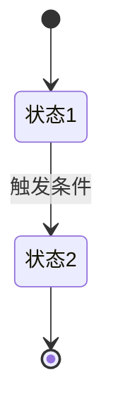

# 模块级需求文档 (Module PRD) 规范

> 规范模块级需求文档的结构，确保包含足够的细节供 AI 生成具体的代码、接口设计和技术文档。

每个功能模块的需求文档应保持独立且详尽。AI 将基于此文档生成数据库设计、接口定义和前端组件。

## 1. 核心要素要求

- **功能概述**：清晰界定功能的职责边界。
- **核心逻辑 (Logic)**：必须详尽描述业务规则、公式计算、触发条件及异常处理。
- **交互需求 (UI/UX)**：描述页面布局组件，并使用 Mermaid 流程图描述交互逻辑。
- **数据模型需求 (Data Model)**：以表格形式列出字段名、类型、必填项及业务含义。
- **接口需求 (API)**：描述输入/输出核心字段及具体的业务校验规则。
- **验收标准 (AC)**：提供可核对的功能点清单。

## 2. 标准模板

```markdown
# 模块：[模块名称] 需求文档

## 1. 功能概述
- **功能描述**：[描述模块核心功能]
- **使用场景**：[描述用户在什么情况下使用]

## 2. 用户故事 (User Stories)
- 作为 [角色], 我想要 [动作], 以便 [价值]。

## 3. 功能详细说明
### 3.1 核心逻辑 (Logic)
- **业务规则 1**：[描述触发条件、处理逻辑、预期结果]
- **业务规则 2**：[异常流程处理]

### 3.2 交互需求 (UI/UX)

- **页面元素**：[描述搜索框、按钮、表格等组件]

## 4. 数据模型需求 (Data Model)

| 字段名 | 类型 | 必填 | 说明 | 示例 |
|--------|------|------|------|------|
| field_name | String | 是 | 业务说明 | "示例值" |

## 5. 接口需求 (API Requirements)

### API 名称/路径描述
- **输入参数**：[列出核心字段]
- **输出结果**：[描述返回结构]
- **校验逻辑**：[如：名称唯一性校验]

## 6. 状态机 (如有)



## 7. 验收标准 (AC)

- [ ] [检查点 1]
- [ ] [检查点 2]
```
